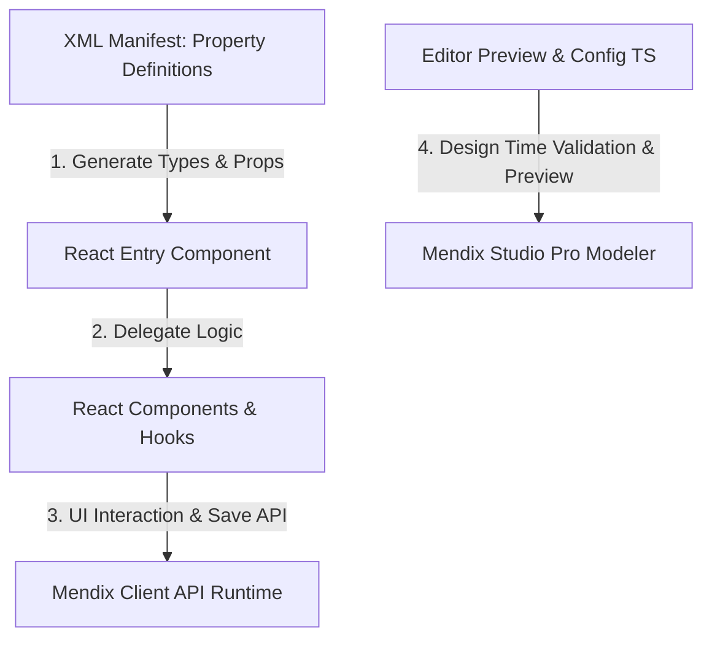

# คู่มือและหลักการทำงานของ Mendix Pluggable Custom Widget

## กรณีศึกษา: `pwbCustomizeContainerDataView`

เอกสารฉบับนี้อธิบายถึงหลักการพัฒนาและกลไกการทำงานเบื้องหลังของ Mendix Pluggable Widget ในรูปแบบ **Customize Container (วิดเจ็ตแบบรองรับการบรรจุเนื้อหาซ้อนภายใน)** โดยอ้างอิงโครงสร้างที่อัปเดตล่าสุดของวิดเจ็ต [pwbCustomizeContainerDataView](file:///Users/lapat.ta/Desktop/ETC%20Project/Customize-mendix-widget-pwb-antigravity/pwbCustomizeContainerDataView)

---

## 1. หลักการพื้นฐานของ Mendix Pluggable Widget

Mendix Pluggable Widgets สร้างขึ้นบนสถาปัตยกรรม **React.js** ซึ่งช่วยให้นักพัฒนาสามารถพัฒนา UI Components ที่ตอบสนองรวดเร็วและใช้มาตรฐานเว็บระดับพรีเมียมได้ โดยมีองค์ประกอบสำคัญ 3 ด้านที่ทำงานเชื่อมประสานกัน:



### 1.1 ไฟล์ Manifest (XML Definition)

ไฟล์ XML ใน [src/PwbCustomizeContainerDataView.xml](file:///Users/lapat.ta/Desktop/ETC%20Project/Customize-mendix-widget-pwb-antigravity/pwbCustomizeContainerDataView/src/PwbCustomizeContainerDataView.xml) เป็นหัวใจสำคัญในการนิยาม "ช่องรับค่า (Properties)" ที่นักพัฒนาจะเห็นใน Mendix Studio Pro โดยคุณสมบัติพิเศษของ Customize Container ได้แก่:

* **DataSource (`isList="true"`):** บังคับใช้บริบทข้อมูล (Entity/List context) สำหรับเป็นแหล่งข้อมูลของเนื้อหาภายใน
* **DropZone (`type="widgets"`):** ประกาศพื้นที่ให้นักพัฒนาลากคอมโพเนนต์อื่นของ Mendix (เช่น Card, ปุ่มกด หรือ Text) มาวางภายในได้ผ่านการตั้งค่า `dataSource="itemsSource"` เพื่อส่งผ่านข้อมูลแถวปัจจุบันให้คอมโพเนนต์ลูกนั้นๆ

### 1.2 วงจรชีวิตและการอัปเดตสถานะ (React Render Loop)

วิดเจ็ตจะทำงานเหมือน React Component ทั่วไป เมื่อข้อมูลในหน้าจอ Mendix มีการเปลี่ยนค่า Mendix Client Runtime จะทำการดึงข้อมูลล่าสุดและส่งผ่านลงมาในรูปแบบของ React `Props` ซึ่ง React Component จะทำการวาดการแสดงผล (Re-render) โดยอัตโนมัติ

---

## 2. โครงสร้างซอร์สโค้ดในเชิงสถาปัตยกรรม (Code Structure)

โครงสร้างโฟลเดอร์ของวิดเจ็ตได้รับการจัดสรรตามหลักการ **Separation of Concerns** เพื่อแยกตรรกะการทำงาน (Business/Interaction Logic) ออกจากความสวยงามและการแสดงผล:

```
pwbCustomizeContainerDataView/
├── src/
│   ├── components/
│   │   └── DragContainer.tsx              # Component หลัก จัดการการเรนเดอร์และควบคุม UI
│   ├── hooks/
│   │   ├── useKeyboardDrag.ts             # ตรรกะจัดการคีย์บอร์ดและ Screen Reader (a11y)
│   │   └── usePointerDrag.ts              # ตรรกะจัดการการลากวาง Pointer, Auto-scroll และ Haptic
│   ├── ui/
│   │   └── PwbCustomizeContainerDataView.css # ดีไซน์โทเค็น แอนิเมชัน และการจัดการ Dark Mode
│   ├── PwbCustomizeContainerDataView.tsx   # Entry Point ทำหน้าที่เตรียม Props และ Sanitization
│   ├── PwbCustomizeContainerDataView.editorConfig.ts # จัดการการเช็คข้อผิดพลาดและปิด/เปิดช่องกรอกใน Modeler
│   └── PwbCustomizeContainerDataView.editorPreview.tsx # วาดพรีวิวด้านภาพเสมือนจริงใน Modeler
```

---

## 3. หลักการทำงานเบื้องหลัง (Runtime Mechanics)

กลไกหลักของวิดเจ็ต `pwbCustomizeContainerDataView` แบ่งออกเป็น 4 ระบบสำคัญ ได้แก่:

### 3.1 การหน่วงการบันทึกข้อมูลเพื่อความเสถียร (Performance Debouncing)

เมื่อผู้ใช้งานทำการลากวางเปลี่ยนตำแหน่งการ์ดสำเร็จ ระบบไม่ควรส่งคำสั่งบันทึกไปยัง Mendix Server ทันทีในระหว่างเคลื่อนย้ายเพราะจะสร้างภาระทรานแซกชันที่สูงเกินไป:

* **หลักการทำงาน:** ใช้ `debounceTimeoutRef` ด้วย React `useRef` ใน [PwbCustomizeContainerDataView.tsx](file:///Users/lapat.ta/Desktop/ETC%20Project/Customize-mendix-widget-pwb-antigravity/pwbCustomizeContainerDataView/src/PwbCustomizeContainerDataView.tsx)
* **การหน่วงเวลา:** เมื่อตำแหน่งการ์ดสิ้นสุดลง ระบบจะเริ่มนับเวลาถอยหลังตาม `saveDelay` (มิลลิวินาที) หากไม่มีการลากใหม่ขัดจังหวะ ระบบจะรวบรวมรหัสทั้งหมดเป็น Comma-separated string (เช่น `ID1,ID2,ID3`) และสั่งการ `sortedAttribute.setValue(serialized)` เพื่อเซฟลงฐานข้อมูลเพียงครั้งเดียว

### 3.2 ระบบ Optimistic UI ข้ามคอลัมน์ (Cross-Container Kanban Engine)

ในบอร์ด Kanban ที่มีหลายคอลัมน์ การลากการ์ดข้ามระหว่างวิดเจ็ตคนละตัว (คนละคอลัมน์) จะใช้กลไกการส่งผ่านสัญญาณผ่าน **Custom Web Events**:

1. **การลาก (Drag Over):** เมื่อการ์ดลอยเหนือคอลัมน์อื่น ระบบจะส่ง `CustomEvent` ชื่อ `pwb-drag-over-container` พร้อมข้อมูลจำลองของการ์ดชิ้นนั้น
2. **การสลายการ์ดและปักตำแหน่ง (Optimistic Updates):** ก่อนที่ Mendix Server จะบันทึกสถานะใหม่และดึงข้อมูลกลับมาซึ่งต้องใช้เวลาประมวลผล วิดเจ็ตจะบันทึกสถานะชั่วคราวในระดับ Windows Client (`window.__pwbActiveTransition`) เป็นเวลาสูงสุด 1.2 วินาที เพื่อให้ตัวคอลัมน์วาดรูปการ์ดใหม่รอไว้ล่วงหน้าทันที ส่งผลให้ UI ดูลื่นไหลไม่วูบวาบระหว่างรอการตอบกลับจากดาต้าเบส

### 3.3 การควบคุมและการเคลียร์สถานะอย่างปลอดภัย (Pointer Capture & Teardown)

ในการรับรู้นิ้วสัมผัสและพิกัดเมาส์:

* **Pointer Capture:** ใช้คำสั่ง `setPointerCapture` เพื่อบังคับให้อีเวนต์การขยับนิ้วทั้งหมดส่งตรงมาที่การ์ดใบที่ถูกจับ แม้ผู้ใช้จะลากนิ้วหลุดออกนอกขอบของการ์ดนั้นไปแล้ว
* **lostpointercapture listener:** เพื่อป้องกันเศษการ์ดจำลองค้างหน้าจอ (UI Ghost Card) ระบบจะฟังอีเวนต์ `lostpointercapture` เสมอ หากผู้ใช้ถูกรบกวนสัญญาณสัมผัส เช่น มีสายโทรเข้า หรือกดสลับหน้าต่างทำงานกะทันหัน ฟังก์ชัน `cleanup` จะถูกยิงโดยอัตโนมัติเพื่อคืนค่า CSS ของเมาส์ ลบเศษการ์ดลอยตัว และล้าง Listener ที่ค้างอยู่ในหน่วยความจำทิ้งทันที

### 3.4 การสั่นเตือนบนอุปกรณ์ที่รองรับ (Safe Haptic Feedback)

* **หลักการทำงาน:** ใช้ฟังก์ชันครอบ `triggerVibrate` ใน [usePointerDrag.ts](file:///Users/lapat.ta/Desktop/ETC%20Project/Customize-mendix-widget-pwb-antigravity/pwbCustomizeContainerDataView/src/hooks/usePointerDrag.ts) เพื่อให้เวลาลากการ์ดหยิบขึ้นมาหรือปล่อยวาง จะมีแรงสั่นตอบสนองเบาๆ บนมือถือ
* **การรองรับ iOS/Safari:** เนื่องจากเบราว์เซอร์ของฝั่ง Apple ไม่รองรับ `vibrate` API ระบบจึงตรวจสอบ `typeof window.navigator.vibrate === "function"` พร้อมใส่บล็อก `try-catch` คลุมไว้ เพื่อป้องกันไม่ให้เกิดความผิดพลาดในการประมวลผลโค้ดจาวาสคริปต์ในระบบ iOS

---

## 4. ประสบการณ์นักพัฒนาในการใช้ร่วมกับ Studio Pro (DX Integration)

วิดเจ็ต Pluggable ใน Mendix แตกต่างจากคอมโพเนนต์ React ทั่วไปตรงที่มีการออกแบบเพื่อซัพพอร์ตโปรแกรมเขียนแอป Mendix Studio Pro:

### 4.1 ตรรกะตรวจสอบการตั้งค่า (Validation Check)

ในไฟล์ [PwbCustomizeContainerDataView.editorConfig.ts](file:///Users/lapat.ta/Desktop/ETC%20Project/Customize-mendix-widget-pwb-antigravity/pwbCustomizeContainerDataView/src/PwbCustomizeContainerDataView.editorConfig.ts) จะมีฟังก์ชันหลัก 2 ตัว:

* `getProperties`: ใช้ในการซ่อนแถบคำสั่งที่ไม่จำเป็นเมื่อผู้ใช้อยู่ในโหมดอื่น (เช่น ซ่อนการตั้งค่า Kanban ทั้งหมดหากผู้ใช้ติ๊กเปิดโหมด Read Only) เพื่อช่วยให้แถบ Properties ด้านข้างของนักพัฒนาสะอาดเข้าใจง่าย
* `check`: ช่วยตรวจสอบไวยากรณ์และความถูกต้องในการผูกแอตทริบิวต์ เช่น แจ้งเตือนข้อผิดพลาดทันทีหากผู้ใช้เปิดโหมด Read Only แต่ลืมผูกแอตทริบิวต์ `Sort ID` สำหรับจัดเรียงลำดับ หรือลืมระบุค่า Drag Group เมื่อใช้โหมดลากข้ามคอลัมน์

### 4.2 การจำลองการแสดงผลเสมือนจริง (High-Fidelity Studio Pro Previews)

ไฟล์ [PwbCustomizeContainerDataView.editorPreview.tsx](file:///Users/lapat.ta/Desktop/ETC%20Project/Customize-mendix-widget-pwb-antigravity/pwbCustomizeContainerDataView/src/PwbCustomizeContainerDataView.editorPreview.tsx) ทำหน้าที่จำลองการเรนเดอร์ในหน้า Modeler:

* **DropZone Rendering:** วาดพื้นที่เพื่อให้สามารถเอากล่องข้อความหรือคอมโพเนนต์ย่อยของ Mendix มาลากวางทับลงไปได้โดยตรง (ไม่ใช่รูปภาพสมมติ)
* **Visual Mimicking:** ดึงสไตล์ของธีมมาวาดล่วงหน้า ไม่ว่าจะเป็นสไตล์กระจกเบลอ กรอบสี่เหลี่ยมหนาสไตล์ Brutalist หรือการจัดตำแหน่งแนวนอน/แนวตั้ง ทำให้นักพัฒนามองเห็นโครงสร้าง UI จริงได้โดยตรงโดยไม่ต้องเปิดแอปขึ้นมาเช็คบ่อยๆ

---

## สรุปแนวทางปฏิบัติที่ดีที่สุด (Best Practices)

1. **Keep UI Stretched:** เคลียร์ Layout Shift โดยใช้การคำนวณพื้นที่จัดวาง Placeholder ล่วงหน้า
2. **Debounce State Write:** หลีกเลี่ยงการเขียนสถานะลง Mendix Data Attribute ถี่เกินไปโดยใช้ระบบ Timeout หน่วงความเร็วก่อนบันทึกเสมอ
3. **Cross-platform fallback:** ตรวจสอบความเข้ากันได้ของเว็บเบราว์เซอร์ในฝั่ง Mobile (ทั้ง Android Chrome และ iOS Safari) สำหรับ API ควบคุมฮาร์ดแวร์เสมอ
