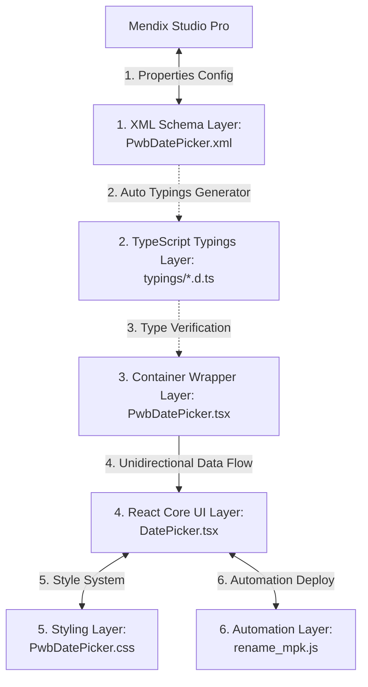

# คู่มืออ้างอิงโครงสร้างไฟล์และหน้าที่รับผิดชอบสำหรับผู้พัฒนา Pluggable Widget

เอกสารฉบับนี้จัดทำขึ้นเพื่อเป็น **คัมภีร์โครงสร้างไฟล์ (Developer File Reference Guide)** สำหรับนักพัฒนาที่ต้องเข้ามารับช่วงต่อเพื่อบำรุงรักษา ปรับปรุง หรือพัฒนาฟีเจอร์เพิ่มเติมในโปรเจกต์ Custom Pluggable Widget นี้ เอกสารนี้จะอธิบายถึงบทบาท หน้าที่รับผิดชอบหลัก และแนวทางการแก้ไขของแต่ละไฟล์อย่างชัดเจน เพื่อให้การพัฒนาเป็นระบบและป้องกันการแก้ไขไฟล์ที่ผิดจุด

---

## 🎨 สถาปัตยกรรมของตัวระบบ (Architecture Overview)

สถาปัตยกรรมของ Widget ชุดนี้ถูกออกแบบภายใต้หลักการ **Separation of Concerns (การแยกสัดส่วนความรับผิดชอบ)** แบ่งออกเป็น 4 ชั้นหลัก:

---

## 📁 รายละเอียดและหน้าที่รับผิดชอบรายไฟล์ (File-by-File Reference)

### 1. โฟลเดอร์หลักของโปรเจกต์ (Monorepo Root Level)

#### 📝 [package.json (Root)](file:///Users/lapat.ta/Desktop/ETC%20Project/Customize-mendix-widget-pwb-antigravity/package.json)
*   **บทบาท**: จัดการการเชื่อมโยง workspaces และคำสั่งลัดสำหรับภาพรวมของโปรเจกต์
*   **หน้าที่หลัก**: 
    *   กำหนดขอบเขตของ workspaces ภายในโปรเจกต์ (เช่น ค้นหาโฟลเดอร์ใด ๆ ที่ขึ้นต้นด้วย `pwb*`)
    *   เก็บสคริปต์ความสะดวกระดับ Root เช่น การสั่ง Build/Release ทุกลิงก์พร้อมกัน หรือการรันสคริปต์ Bump Version (ขยับเลขเวอร์ชันอัตโนมัติ)
*   **คำแนะนำในการพัฒนา**: แก้ไขเฉพาะเมื่อต้องการเพิ่มคำสั่งลัด (convenience scripts) ระดับ Root หรือต้องการเพิ่ม/ลดโฟลเดอร์ที่เป็น workspaces

#### 📝 [scripts/rename_mpk.js](file:///Users/lapat.ta/Desktop/ETC%20Project/Customize-mendix-widget-pwb-antigravity/scripts/rename_mpk.js)
*   **บทบาท**: สคริปต์ออโตเมชันสำหรับการทำ Packaging และ Deploy
*   **หน้าที่หลัก**:
    *   ดึงเลขเวอร์ชันปัจจุบันจาก `package.json` ของวิดเจ็ต
    *   แปลงชื่อไฟล์เป็นชื่อฟอร์แมตพิเศษที่ระบุเวอร์ชันและวันเวลา เช่น `pwb.PwbDatePicker_1.0.5_20260529_113759.mpk`
    *   ค้นหาโฟลเดอร์ widgets ของโปรเจกต์ Mendix แล้วทำความสะอาด (ลบไฟล์เก่าทิ้งทั้งหมด) ก่อนก๊อปปี้ไฟล์บิวด์ตัวใหม่เข้าไปแทนที่
*   **คำแนะนำในการพัฒนา**: แก้ไขไฟล์นี้หากคุณต้องการเปลี่ยนแปลงเป้าหมายการก๊อปปี้ หรือต้องการปรับแต่งฟอร์แมตการตั้งชื่อไฟล์บันเดิล `.mpk`

---

### 2. โฟลเดอร์ของตัววิดเจ็ต (Widget Specific Level - `pwbDatePicker/`)

#### 📝 [pwbDatePicker/package.json](file:///Users/lapat.ta/Desktop/ETC%20Project/Customize-mendix-widget-pwb-antigravity/pwbDatePicker/package.json)
*   **บทบาท**: จัดการ dependencies และการตั้งค่าเป้าหมายการรันของวิดเจ็ต
*   **หน้าที่หลัก**:
    *   ระบุชื่อวิดเจ็ต (`widgetName`) และโฟลเดอร์ปลายทางของ Mendix (`packagePath`)
    *   กำหนด `"config.projectPath"` ซึ่งชี้พิกัดไปยังแอป Mendix ตัวหลักของคุณ เพื่อส่งไฟล์ `.mpk` ไปทำงาน
    *   จัดการคำสั่งพัฒนาย่อย เช่น `npm run dev` (ระบบเฝ้าดูการพิมพ์โค้ด) และ `npm run release`
*   **คำแนะนำในการพัฒนา**: เมื่อนำโปรเจกต์นี้ไปรันในเครื่องพัฒนาเครื่องใหม่ **คุณจะต้องแก้ไขฟิลด์ `config.projectPath` ให้ตรงตามโฟลเดอร์โปรเจกต์ Mendix บนเครื่องของคุณ**

#### 📝 [pwbDatePicker/tsconfig.json](file:///Users/lapat.ta/Desktop/ETC%20Project/Customize-mendix-widget-pwb-antigravity/pwbDatePicker/tsconfig.json)
*   **บทบาท**: กำหนดคุณสมบัติและมาตรฐานความปลอดภัยของการแปลงไฟล์ TypeScript
*   **หน้าที่หลัก**: ควบคุมประเภทความปลอดภัยของการตรวจเช็ค และสร้างประเภทไฟล์ Bundling
*   **คำแนะนำในการพัฒนา**: โดยทั่วไปไม่มีความจำเป็นต้องทำการแก้ไขไฟล์นี้ เว้นแต่ต้องการปรับแต่ง Path Aliases หรือเพิ่ม/ลดมาตรฐานความเข้มงวดของการตรวจเช็คของ Compiler

#### 📝 [pwbDatePicker/typings/PwbDatePickerProps.d.ts](file:///Users/lapat.ta/Desktop/ETC%20Project/Customize-mendix-widget-pwb-antigravity/pwbDatePicker/typings/PwbDatePickerProps.d.ts)
*   **บทบาท**: ไฟล์ประเภทตัวแปร TypeScript (TypeScript Definitions)
*   **หน้าที่หลัก**: เก็บชนิดประเภทตัวแปรของ Properties ทั้งหมดของ Mendix เพื่อส่งต่อไปให้ React
*   **คำแนะนำในการพัฒนา**: ⚠️ **ห้ามทำการแก้ไขไฟล์นี้ด้วยตนเองเด็ดขาด!** เนื่องจากไฟล์นี้จะถูกลบและสร้างขึ้นใหม่โดยอัตโนมัติผ่านคอมไพเลอร์ของ Mendix ทุกครั้งที่คุณสั่งรันโปรเจกต์

---

### 3. โฟลเดอร์ควบคุมการทำงานหลัก (Widget Source Level - `src/`)

#### 📝 [src/package.xml](file:///Users/lapat.ta/Desktop/ETC%20Project/Customize-mendix-widget-pwb-antigravity/pwbDatePicker/src/package.xml)
*   **บทบาท**: แผนภาพการบรรจุหีบห่อของไฟล์ลงในแพ็กเกจ `.mpk` (Mendix Package Manifest)
*   **หน้าที่หลัก**: ระบุว่าไฟล์ปลายทางใดบ้างในแผงบิวด์ของโปรเจกต์ ที่จะต้องถูกมัดรวมเข้าไปในไฟล์ `.mpk` เพื่อนำเข้าสู่ Studio Pro
*   **คำแนะนำในการพัฒนา**: โดยปกติจะไม่มีการเปลี่ยนรูป ยกเว้นกรณีต้องการมัดรวมซอร์สทรัพยากรพิเศษแยกต่างหาก เช่น ไฟล์ฟอนต์ หรือรูปภาพพื้นหลังดิบ

#### 📝 [src/PwbDatePicker.xml](file:///Users/lapat.ta/Desktop/ETC%20Project/Customize-mendix-widget-pwb-antigravity/pwbDatePicker/src/PwbDatePicker.xml)
*   **บทบาท**: ตัวกำหนดคุณสมบัติหน้าตั้งค่า (Property Schema Definitions)
*   **หน้าที่หลัก**: 
    *   กำหนดหน้าตาการตั้งค่าคุณสมบัติ (Properties) ทั้งหมดที่จะโชว์ให้เห็นเมื่อนักพัฒนาดับเบิ้ลคลิกวิดเจ็ตใน Mendix Studio Pro
    *   กำหนดประเภทตัวแปร (เช่น string, boolean, expression, attribute) และคุณสมบัติที่ระบุค่าดีฟอลต์ (Default Value)
*   **คำแนะนำในการพัฒนา**: เมื่อใดก็ตามที่คุณต้องการ **เพิ่มฟิลด์ปุ่ม ฟิลด์กรอกข้อมูล หรือคุณสมบัติใด ๆ ในฝั่งโปรแกรม Mendix** จุดนี้คือไฟล์เดียวที่คุณต้องประกาศฟิลด์เป็นจุดแรกเสมอ

#### 📝 [src/PwbDatePicker.tsx](file:///Users/lapat.ta/Desktop/ETC%20Project/Customize-mendix-widget-pwb-antigravity/pwbDatePicker/src/PwbDatePicker.tsx)
*   **บทบาท**: ตัวครอบแลกเปลี่ยนชั้นนอก (Container / Wrapper Component)
*   **หน้าที่หลัก**: 
    *   รับค่า Properties ทั้งหมดที่ Mendix ป้อนเข้ามา
    *   ดึงสถานะพิเศษฝั่ง Mendix เช่น ตรวจสอบสถานะ Read-only ของแอตทริบิวต์
    *   ตรวจสอบความถูกต้องของการกรอกข้อมูล (Validation) และการแจ้งเตือน Error
    *   เป็นตัวกลางส่งต่อ (Bridge) ตัวแปรทั้งหมดไปให้กับคอมโพเนนต์ React หลัก
*   **คำแนะนำในการพัฒนา**: แก้ไขไฟล์นี้เมื่อต้องการเชื่อมค่า Property ตัวใหม่ที่ประกาศใน XML ส่งลงไปให้ React ใช้งาน หรือต้องการแก้ไขข้อความเงื่อนไข Validation เชิงระบบ Mendix

#### 📝 [src/PwbDatePicker.editorPreview.tsx](file:///Users/lapat.ta/Desktop/ETC%20Project/Customize-mendix-widget-pwb-antigravity/pwbDatePicker/src/PwbDatePicker.editorPreview.tsx)
*   **บทบาท**: ตัวแสดงผลลัพธ์จำลองบนหน้าเพจออกแบบของ Mendix (Page Builder Editor Preview)
*   **หน้าที่หลัก**: แสดงโมเดลรูปจำลองเสมือนจริงของปฏิทินในแผงจัดวาง Mendix Studio Pro (ไม่ให้วิดเจ็ตแสดงกล่องข้อความเปล่า ๆ ซึ่งจะทำให้หน้ากระดาษพังและออกแบบยาก)
*   **คำแนะนำในการพัฒนา**: ปรับเปลี่ยนเล็กน้อยเมื่อต้องการให้หน้าตาพรีวิวในการจัดวาง Mendix ดูลื่นไหลหรือแสดงกรอบกล่องที่สวยงามขึ้น

#### 📝 [src/PwbDatePicker.editorConfig.ts](file:///Users/lapat.ta/Desktop/ETC%20Project/Customize-mendix-widget-pwb-antigravity/pwbDatePicker/src/PwbDatePicker.editorConfig.ts)
*   **บทบาท**: สคริปต์ควบคุม UI พร็อพเพอร์ตี้ของฝั่ง Mendix Editor
*   **หน้าที่หลัก**: ควบคุมพฤติกรรม เช่น ซ่อน Properties ของ `StartDate` และ `EndDate` หากนักพัฒนาเลือกโหมดปฏิทินเป็น `Single Date`
*   **คำแนะนำในการพัฒนา**: แก้ไขเมื่อต้องการตั้งค่าการซ่อนหรือแสดง Properties เพื่ออำนวยความสะดวกในการกรอกข้อมูลของ Developer ฝั่ง Mendix ไม่ให้งงกับตัวเลือกที่ซับซ้อน

#### 📝 [src/components/DatePicker.tsx](file:///Users/lapat.ta/Desktop/ETC%20Project/Customize-mendix-widget-pwb-antigravity/pwbDatePicker/src/components/DatePicker.tsx)
*   **บทบาท**: คอมโพเนนต์ React หลักที่แท้จริง (Core Presentational Logic Component)
*   **หน้าที่หลัก**: 
    *   ควบคุมตรรกะทั้งหมดของหน้าปฏิทิน (การคำนวณวัน, การเปลี่ยนเดือน, การเลือกช่วงเวลา, การสลับปี พ.ศ./ค.ศ.)
    *   จัดการและเรนเดอร์โครงสร้างปฏิทินจริงลงเบราว์เซอร์
    *   ระบบทางลัด Preset ปุ่มกด และระบบคีย์บอร์ดทั้งหมด
*   **คำแนะนำในการพัฒนา**: **นี่คือไฟล์ที่สำคัญที่สุดในการพัฒนา UX/UI ฟังก์ชันหลักทั้งหมด** ปรับแต่งแก้โค้ดที่นี่หากต้องการเปลี่ยนลอจิกการกดปุ่ม, รูปแบบตาราง, หรือการทำงานของการสลับช่วงวันที่

#### 📝 [src/ui/PwbDatePicker.css](file:///Users/lapat.ta/Desktop/ETC%20Project/Customize-mendix-widget-pwb-antigravity/pwbDatePicker/src/ui/PwbDatePicker.css)
*   **บทบาท**: ไฟล์จัดระเบียบสไตล์ทั้งหมด (Premium CSS Design System)
*   **หน้าที่หลัก**: 
    *   กำหนดคลาส CSS ทั้งหมด และตัวแปร CSS Tokens (`--accent-color`, `--border-radius`)
    *   เรนเดอร์เอฟเฟกต์ Glassmorphism, ขอบมน และแอนิเมชันลอยต่าง ๆ ทั้งปวง
*   **คำแนะนำในการพัฒนา**: แก้ไขไฟล์นี้เมื่อต้องการเปลี่ยนเฉดสี แสงเงา ขอบมน ระยะพิกเซล แฟลชสีกะพริบ หรือแอนิเมชันเลื่อนสไลด์ต่าง ๆ เพื่อเปลี่ยนหน้าตาของตัวปฏิทิน

---

## 💡 ตารางอ้างอิงรวดเร็ว: "อยากปรับเปลี่ยนตรงนี้...ต้องแก้ที่ไฟล์ไหน?"

| สิ่งที่ต้องการทำ (Goal) | ไฟล์หลักที่เกี่ยวข้อง (Core File) | ไฟล์รองที่ต้องแก้ไขตาม (Supporting File) |
| :--- | :--- | :--- |
| **เพิ่มช่องกรอกข้อมูล/พร็อพเพอร์ตี้ใน Mendix** | [PwbDatePicker.xml](file:///Users/lapat.ta/Desktop/ETC%20Project/Customize-mendix-widget-pwb-antigravity/pwbDatePicker/src/PwbDatePicker.xml) | [PwbDatePicker.tsx](file:///Users/lapat.ta/Desktop/ETC%20Project/Customize-mendix-widget-pwb-antigravity/pwbDatePicker/src/PwbDatePicker.tsx) และ [DatePicker.tsx](file:///Users/lapat.ta/Desktop/ETC%20Project/Customize-mendix-widget-pwb-antigravity/pwbDatePicker/src/components/DatePicker.tsx) |
| **ซ่อนกล่องข้อความออปชันในแผงคุณสมบัติเมื่อกดสลับตัวเลือก** | [PwbDatePicker.editorConfig.ts](file:///Users/lapat.ta/Desktop/ETC%20Project/Customize-mendix-widget-pwb-antigravity/pwbDatePicker/src/PwbDatePicker.editorConfig.ts) | - |
| **เปลี่ยนโครงสร้างตรรกะใน React (เช่น การกดเลือกวันเกิด)** | [DatePicker.tsx](file:///Users/lapat.ta/Desktop/ETC%20Project/Customize-mendix-widget-pwb-antigravity/pwbDatePicker/src/components/DatePicker.tsx) | - |
| **ปรับสีไฮไลต์, สีตัวเลือก, ขอบมน, หรือภาพเคลื่อนไหว** | [PwbDatePicker.css](file:///Users/lapat.ta/Desktop/ETC%20Project/Customize-mendix-widget-pwb-antigravity/pwbDatePicker/src/ui/PwbDatePicker.css) | - |
| **ปรับเปลี่ยนเส้นทางการก็อปปี้ไฟล์ `.mpk` ไปแอป Mendix** | [pwbDatePicker/package.json](file:///Users/lapat.ta/Desktop/ETC%20Project/Customize-mendix-widget-pwb-antigravity/pwbDatePicker/package.json) | - |
| **เพิ่มคำแปลปุ่มกดเพื่อรองรับระบบ Batch Translate** | [PwbDatePicker.xml](file:///Users/lapat.ta/Desktop/ETC%20Project/Customize-mendix-widget-pwb-antigravity/pwbDatePicker/src/PwbDatePicker.xml) | [PwbDatePicker.tsx](file:///Users/lapat.ta/Desktop/ETC%20Project/Customize-mendix-widget-pwb-antigravity/pwbDatePicker/src/PwbDatePicker.tsx) และ [DatePicker.tsx](file:///Users/lapat.ta/Desktop/ETC%20Project/Customize-mendix-widget-pwb-antigravity/pwbDatePicker/src/components/DatePicker.tsx) |
