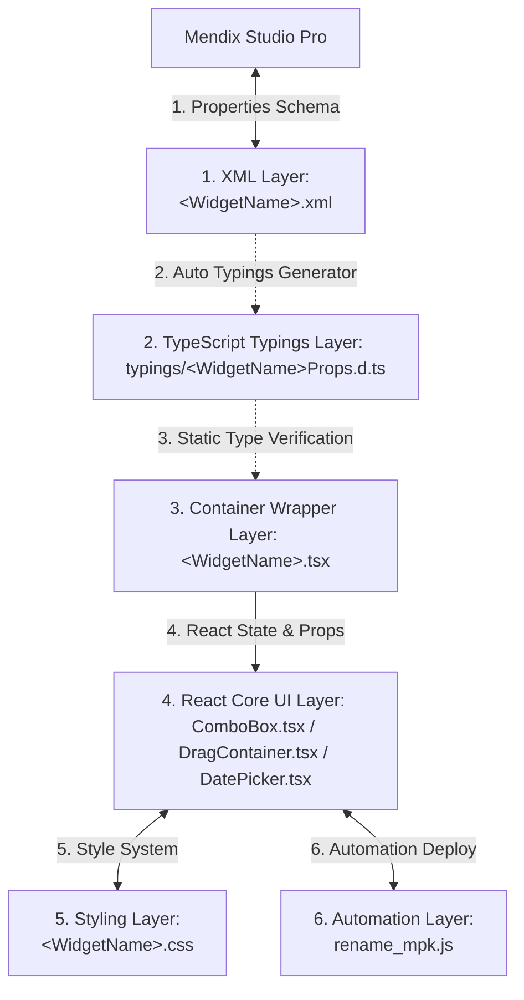

# คู่มืออ้างอิงโครงสร้างไฟล์และหน้าที่รับผิดชอบสำหรับผู้พัฒนา (Developer File Reference Guide)

เอกสารฉบับนี้จัดทำขึ้นเพื่อเป็น **คัมภีร์โครงสร้างไฟล์และหน้าที่รับผิดชอบ** สำหรับนักพัฒนาที่ต้องเข้ามารับช่วงต่อเพื่อบำรุงรักษา ปรับปรุง หรือพัฒนาฟีเจอร์เพิ่มเติมในโครงการหลัก **Customize-mendix-widget-pwb-antigravity** ซึ่งเป็นระบบ Monorepo ที่บรรจุ Custom Pluggable Widgets ทั้งหมด 3 ตัว ได้แก่:
1. **pwbComboBox** (วิดเจ็ตกล่องตัวเลือก autocomplete)
2. **pwbCustomizeContainerDataView** (วิดเจ็ตตู้คอนเทนเนอร์ drag-and-drop)
3. **pwbDatePicker** (วิดเจ็ตเครื่องมือเลือกวันที่)

---

## 🎨 สถาปัตยกรรมทางวิศวกรรมของวิดเจ็ต (Architecture Overview)

โครงสร้างของ Pluggable Widget แต่ละตัวในโครงการนี้ถูกออกแบบภายใต้หลักการ **Separation of Concerns (การแยกส่วนหน้าที่ความรับผิดชอบ)** โดยแบ่งส่วนประกอบออกเป็น 6 ชั้นหลัก:



---

## 📂 โครงสร้างเวิร์กสเปซ Monorepo (Workspace Directory Tree)

นี่คือแผนผังแสดงโครงสร้างโฟลเดอร์ปัจจุบันที่ใช้งานจริงในโปรเจกต์:

```bash
Customize-mendix-widget-pwb-antigravity/             # [Repository Root]
├── package.json                                    # รูทสคริปต์สำหรับการจัดการ workspaces ทั้งหมด
├── package-lock.json
├── scripts/
│   └── rename_mpk.js                               # สคริปต์จัดส่งไฟล์ .mpk อัตโนมัติไปยังโปรเจกต์ Mendix
├── Document/                                       # โฟลเดอร์รวมคู่มือเอกสาร
│   ├── dependencies_guide.md                       # คู่มืออธิบาย dependencies ทั้งหมด
│   └── developer_file_reference.md                # เอกสารคู่มือฉบับนี้
│
├── pwbComboBox/                                    # [Widget ตัวที่ 1: ComboBox]
│   ├── package.json                                # ตั้งค่าเป้าหมายการส่งไฟล์และ dependencies
│   ├── tsconfig.json                               # คอนฟิกการแปลงไฟล์ TypeScript
│   ├── typings/
│   │   └── PwbComboBoxProps.d.ts                   # ไฟล์ type-definition ของคุณสมบัติ (Auto-generated)
│   └── src/
│       ├── package.xml                             # รายการทรัพยากรสำหรับแพ็คเกจ .mpk
│       ├── PwbComboBox.xml                         # XML กำหนดอินเทอร์เฟซฝั่ง Mendix
│       ├── PwbComboBox.tsx                         # Wrapper รับค่าจาก Mendix เพื่อส่งลง React
│       ├── PwbComboBox.editorPreview.tsx           # หน้าตาพรีวิวเวลาจัดเลย์เอาต์ใน Studio Pro
│       ├── PwbComboBox.editorConfig.ts             # โค้ดควบคุมการซ่อน/แสดงฟิลด์บน Mendix properties
│       ├── components/
│       │   └── ComboBox.tsx                        # คอมโพเนนต์ React UI หลักของ ComboBox
│       └── ui/
│           └── PwbComboBox.css                     # สไตล์ชีทควบคุมการตกแต่ง ComboBox
│
├── pwbCustomizeContainerDataView/                  # [Widget ตัวที่ 2: Customize DataView Container]
│   ├── package.json
│   ├── tsconfig.json
│   ├── typings/
│   │   └── PwbCustomizeContainerDataViewProps.d.ts
│   └── src/
│       ├── package.xml
│       ├── PwbCustomizeContainerDataView.xml
│       ├── PwbCustomizeContainerDataView.tsx
│       ├── PwbCustomizeContainerDataView.editorPreview.tsx
│       ├── PwbCustomizeContainerDataView.editorConfig.ts
│       ├── components/
│       │   └── DragContainer.tsx                   # คอมโพเนนต์ React UI หลักของ DataView Drag-and-Drop
│       └── ui/
│           └── PwbCustomizeContainerDataView.css   # สไตล์ชีทควบคุมการตกแต่ง Container
│
└── pwbDatePicker/                                  # [Widget ตัวที่ 3: DatePicker]
    ├── package.json
    ├── tsconfig.json
    ├── typings/
    │   └── PwbDatePickerProps.d.ts
    └── src/
        ├── package.xml
        ├── PwbDatePicker.xml
        ├── PwbDatePicker.tsx
        ├── PwbDatePicker.editorPreview.tsx
        ├── PwbDatePicker.editorConfig.ts
        ├── components/
        │   └── DatePicker.tsx                      # คอมโพเนนต์ React UI หลักของ DatePicker
        └── ui/
            └── PwbDatePicker.css                   # สไตล์ชีทควบคุมการตกแต่ง DatePicker
```

---

## 📝 หน้าที่รับผิดชอบและการแก้ไขไฟล์รายโฟลเดอร์

### 1. โฟลเดอร์ระดับบนสุด (Monorepo Root Level)

#### ⚙️ [package.json (Root)](file:///Users/lapat.ta/Desktop/ETC%20Project/Customize-mendix-widget-pwb-antigravity/package.json)
* **หน้าที่**: ควบคุมความสัมพันธ์แบบ Monorepo Workspaces และเก็บคีย์ลัดสคริปต์บิลด์หลัก
* **เมื่อใดที่ต้องแก้ไข**: ต้องการลงทะเบียนโฟลเดอร์ย่อยตัวใหม่ในโครงการ หรือต้องการเขียนสคริปต์สแกนตรวจสอบ/บิลด์อัตโนมัติระดับภาพรวม เช่น คำสั่งลัดบิลด์แยกรายตัว (`npm run build:pwbComboBox` เป็นต้น)

#### 🚀 [scripts/rename_mpk.js](file:///Users/lapat.ta/Desktop/ETC%20Project/Customize-mendix-widget-pwb-antigravity/scripts/rename_mpk.js)
* **หน้าที่**: รันหลังจบบิลด์ (`post-build release`) เพื่อเข้าทำความสะอาดโฟลเดอร์ปลายทางของ Mendix และย้ายพร้อมเปลี่ยนชื่อไฟล์ `.mpk` ตัวล่าสุดให้ระบุเวอร์ชันและวันเวลาการจัดทำอย่างชัดเจน
* **เมื่อใดที่ต้องแก้ไข**: ต้องการเปลี่ยนเป้าหมายจัดเก็บไฟล์สำรอง `.mpk` หรือต้องการปรับแต่งฟอร์แมตการประทับเวลาระบุเวอร์ชัน

---

### 2. โฟลเดอร์ระบุคอนฟิกและเครื่องมือของแต่ละวิดเจ็ต (Widget Config Level)

| ไฟล์คอนฟิกของ Widget | pwbComboBox | pwbCustomizeContainerDataView | pwbDatePicker |
| :--- | :---: | :---: | :---: |
| **package.json** *(กำหนดปลายทางโฟลเดอร์ของแอป Mendix บนเครื่องตนเอง)* | [ลิงก์ไฟล์](file:///Users/lapat.ta/Desktop/ETC%20Project/Customize-mendix-widget-pwb-antigravity/pwbComboBox/package.json) | [ลิงก์ไฟล์](file:///Users/lapat.ta/Desktop/ETC%20Project/Customize-mendix-widget-pwb-antigravity/pwbCustomizeContainerDataView/package.json) | [ลิงก์ไฟล์](file:///Users/lapat.ta/Desktop/ETC%20Project/Customize-mendix-widget-pwb-antigravity/pwbDatePicker/package.json) |
| **tsconfig.json** *(การตั้งค่า compiler ของ TypeScript)* | [ลิงก์ไฟล์](file:///Users/lapat.ta/Desktop/ETC%20Project/Customize-mendix-widget-pwb-antigravity/pwbComboBox/tsconfig.json) | [ลิงก์ไฟล์](file:///Users/lapat.ta/Desktop/ETC%20Project/Customize-mendix-widget-pwb-antigravity/pwbCustomizeContainerDataView/tsconfig.json) | [ลิงก์ไฟล์](file:///Users/lapat.ta/Desktop/ETC%20Project/Customize-mendix-widget-pwb-antigravity/pwbDatePicker/tsconfig.json) |
| **typings/*.d.ts** *(ไฟล์ประกาศประเภทตัวแปรฝั่ง Mendix)* | [ลิงก์ไฟล์](file:///Users/lapat.ta/Desktop/ETC%20Project/Customize-mendix-widget-pwb-antigravity/pwbComboBox/typings/PwbComboBoxProps.d.ts) | [ลิงก์ไฟล์](file:///Users/lapat.ta/Desktop/ETC%20Project/Customize-mendix-widget-pwb-antigravity/pwbCustomizeContainerDataView/typings/PwbCustomizeContainerDataViewProps.d.ts) | [ลิงก์ไฟล์](file:///Users/lapat.ta/Desktop/ETC%20Project/Customize-mendix-widget-pwb-antigravity/pwbDatePicker/typings/PwbDatePickerProps.d.ts) |

> [!WARNING]
> ไฟล์ในโฟลเดอร์ `typings/` ถูกเจนเนอเรตขึ้นโดยอัตโนมัติจากไฟล์โครงสร้าง XML ของแต่ละวิดเจ็ต **ห้ามแก้ไขไฟล์เหล่านี้ด้วยมือเปล่าอย่างเด็ดขาด** เพราะจะถูกเขียนทับทันทีเมื่อสั่งบิลด์ใหม่

---

### 3. ไฟล์แหล่งข้อมูลและตรรกะเบื้องหลังภายใน `src/` (Widget Source Level)

โครงสร้างไฟล์และรายละเอียดหน้าที่รับผิดชอบของวิดเจ็ตทั้ง 3 ตัว ประกอบด้วย:

#### 🔹 3.1 ไฟล์อินเทอร์เฟซ XML คุณสมบัติ (`<WidgetName>.xml`)
* **ไฟล์จริง**:
  * pwbComboBox: [PwbComboBox.xml](file:///Users/lapat.ta/Desktop/ETC%20Project/Customize-mendix-widget-pwb-antigravity/pwbComboBox/src/PwbComboBox.xml)
  * pwbCustomizeContainerDataView: [PwbCustomizeContainerDataView.xml](file:///Users/lapat.ta/Desktop/ETC%20Project/Customize-mendix-widget-pwb-antigravity/pwbCustomizeContainerDataView/src/PwbCustomizeContainerDataView.xml)
  * pwbDatePicker: [PwbDatePicker.xml](file:///Users/lapat.ta/Desktop/ETC%20Project/Customize-mendix-widget-pwb-antigravity/pwbDatePicker/src/PwbDatePicker.xml)
* **หน้าที่**: ประกาศโครงสร้าง Properties ทั้งหมดที่นักพัฒนาจะดับเบิ้ลคลิกเพื่อแก้ไขบนหน้าต่างตั้งค่าใน Mendix Studio Pro
* **เมื่อใดที่ต้องแก้ไข**: ต้องการเพิ่มปุ่มกดเปิด/ปิดการทำงาน, ช่องกรอกข้อมูลสอยค่าแอตทริบิวต์ (Attributes), หรือเปิดช่องรับเงื่อนไขเหตุการณ์ของ Mendix (Events)

#### 🔹 3.2 ไฟล์ตัวครอบและแลกเปลี่ยนข้อมูลระดับบน (`<WidgetName>.tsx`)
* **ไฟล์จริง**:
  * pwbComboBox: [PwbComboBox.tsx](file:///Users/lapat.ta/Desktop/ETC%20Project/Customize-mendix-widget-pwb-antigravity/pwbComboBox/src/PwbComboBox.tsx)
  * pwbCustomizeContainerDataView: [PwbCustomizeContainerDataView.tsx](file:///Users/lapat.ta/Desktop/ETC%20Project/Customize-mendix-widget-pwb-antigravity/pwbCustomizeContainerDataView/src/PwbCustomizeContainerDataView.tsx)
  * pwbDatePicker: [PwbDatePicker.tsx](file:///Users/lapat.ta/Desktop/ETC%20Project/Customize-mendix-widget-pwb-antigravity/pwbDatePicker/src/PwbDatePicker.tsx)
* **หน้าที่**: รับข้อมูลดิบจาก XML Layer ของ Mendix เช็กคุณสมบัติการสิทธิ์เข้าถึง (เช่น Read-only/Editable) และช่วยทำความสะอาด/จัดรูปร่างข้อมูล (Validation & Parsing) ก่อนส่งต่อไปเป็น Props ให้กับชิ้นส่วน React UI
* **เมื่อใดที่ต้องแก้ไข**: ต้องการเปลี่ยนตรรกะการตรวจสอบเงื่อนไขความถูกต้อง (Validation Rules) ระดับ Mendix หรือต้องการส่งค่า property ตัวใหม่ที่พึ่งประกาศใน XML ไปให้ React

#### 🔹 3.3 ไฟล์คอมโพเนนต์ React UI แท้จริง (`src/components/`)
* **ไฟล์จริง**:
  * pwbComboBox: [ComboBox.tsx](file:///Users/lapat.ta/Desktop/ETC%20Project/Customize-mendix-widget-pwb-antigravity/pwbComboBox/src/components/ComboBox.tsx)
  * pwbCustomizeContainerDataView: [DragContainer.tsx](file:///Users/lapat.ta/Desktop/ETC%20Project/Customize-mendix-widget-pwb-antigravity/pwbCustomizeContainerDataView/src/components/DragContainer.tsx)
  * pwbDatePicker: [DatePicker.tsx](file:///Users/lapat.ta/Desktop/ETC%20Project/Customize-mendix-widget-pwb-antigravity/pwbDatePicker/src/components/DatePicker.tsx)
* **หน้าที่**: เป็นแกนหลักที่ทำหน้าที่คุมตรรกะการป้อนข้อมูล, สถานะการใช้งาน (Internal State Management), การคำนวณตำแหน่ง, การลากวาง และการเรนเดอร์ UI จริงลงบนหน้าเว็บเบราว์เซอร์
* **เมื่อใดที่ต้องแก้ไข**: **นี่คือจุดหลักสำหรับแก้ไขตรรกะและโครงสร้าง UI/UX ของตัววิดเจ็ต** เช่น ต้องการเปลี่ยนลักษณะการแสดงผลเมนูดร็อปดาวน์, เปลี่ยนขั้นตอนลากเรียงลำดับใหม่ หรือลอจิกการคำนวณปฏิทิน

#### 🔹 3.4 สไตล์ชีทควบคุมการตกแต่ง CSS (`src/ui/`)
* **ไฟล์จริง**:
  * pwbComboBox: [PwbComboBox.css](file:///Users/lapat.ta/Desktop/ETC%20Project/Customize-mendix-widget-pwb-antigravity/pwbComboBox/src/ui/PwbComboBox.css)
  * pwbCustomizeContainerDataView: [PwbCustomizeContainerDataView.css](file:///Users/lapat.ta/Desktop/ETC%20Project/Customize-mendix-widget-pwb-antigravity/pwbCustomizeContainerDataView/src/ui/PwbCustomizeContainerDataView.css)
  * pwbDatePicker: [PwbDatePicker.css](file:///Users/lapat.ta/Desktop/ETC%20Project/Customize-mendix-widget-pwb-antigravity/pwbDatePicker/src/ui/PwbDatePicker.css)
* **หน้าที่**: ควบคุมความสวยงามของธีม (Theme Styles), ขนาดขอบมน, เงาตกกระทบ, แอนิเมชันตอนแสดงผลหรือโฮเวอร์ และโทนสี
* **เมื่อใดที่ต้องแก้ไข**: ต้องการเปลี่ยนรูปลักษณ์ การจัดแนวขอบ, ระยะพิกเซล (Padding/Margin), และเฉดสีเพื่อคงไว้ซึ่งความเป็นพรีเมียม UI

#### 🔹 3.5 ไฟล์ควบคุมโครงสร้างและความสวยงามบนหน้าพรีวิว Mendix Studio Pro (`src/*.editorPreview.tsx` & `src/*.editorConfig.ts`)
* **ไฟล์จริง**:
  * pwbComboBox: [Preview](file:///Users/lapat.ta/Desktop/ETC%20Project/Customize-mendix-widget-pwb-antigravity/pwbComboBox/src/PwbComboBox.editorPreview.tsx) / [Config](file:///Users/lapat.ta/Desktop/ETC%20Project/Customize-mendix-widget-pwb-antigravity/pwbComboBox/src/PwbComboBox.editorConfig.ts)
  * pwbCustomizeContainerDataView: [Preview](file:///Users/lapat.ta/Desktop/ETC%20Project/Customize-mendix-widget-pwb-antigravity/pwbCustomizeContainerDataView/src/PwbCustomizeContainerDataView.editorPreview.tsx) / [Config](file:///Users/lapat.ta/Desktop/ETC%20Project/Customize-mendix-widget-pwb-antigravity/pwbCustomizeContainerDataView/src/PwbCustomizeContainerDataView.editorConfig.ts)
  * pwbDatePicker: [Preview](file:///Users/lapat.ta/Desktop/ETC%20Project/Customize-mendix-widget-pwb-antigravity/pwbDatePicker/src/PwbDatePicker.editorPreview.tsx) / [Config](file:///Users/lapat.ta/Desktop/ETC%20Project/Customize-mendix-widget-pwb-antigravity/pwbDatePicker/src/PwbDatePicker.editorConfig.ts)
* **หน้าที่**:
  * `editorPreview.tsx` - จำลอง UI รูปวาดของวิดเจ็ตเพื่อโชว์บนหน้ากระดานโมเดลเลอร์
  * `editorConfig.ts` - ตรวจเช็คคุณสมบัติ หากผู้ใช้อยู่ในโหมดที่ไม่ได้ใช้ฟังก์ชันใด จะทำหน้าที่ไฮไลต์จางหรือซ่อนฟิลด์ที่สับสนในแผงคุณสมบัติ Properties ทันที
* **เมื่อใดที่ต้องแก้ไข**: ต้องการพัฒนาความสะดวกสบายในขั้นตอนการนำไปใช้ของ Developer ฝั่ง Mendix ไม่ให้นักออกแบบสับสนกับช่องตั้งค่าที่ไม่จำเป็นในบางสเตจการบิวด์แอป

---

## ⚡ ตารางวิเคราะห์ด่วน: "หากต้องการปรับปรุงฟีเจอร์...ต้องไปแก้ที่ใด?"

| สิ่งที่ต้องการทำ (Goal) | วิดเจ็ต | ไฟล์หลักที่เกี่ยวข้อง (Core File) | ไฟล์เชื่อมโยงที่ต้องแก้ตาม |
| :--- | :---: | :--- | :--- |
| **เพิ่มพร็อพเพอร์ตี้กรอกข้อมูลใน Mendix** | **ทั้งหมด** | ไฟล์ `.xml` ของวิดเจ็ตนั้นๆ | ตัวครอบ `.tsx` และ คอมโพเนนต์ใน `components/` |
| **แก้ไขตรรกะค้นหารายการใน ComboBox** | ComboBox | [ComboBox.tsx](file:///Users/lapat.ta/Desktop/ETC%20Project/Customize-mendix-widget-pwb-antigravity/pwbComboBox/src/components/ComboBox.tsx) | - |
| **เปลี่ยนแอนิเมชันลากวางและการสร้างเลน Lane** | Container | [DragContainer.tsx](file:///Users/lapat.ta/Desktop/ETC%20Project/Customize-mendix-widget-pwb-antigravity/pwbCustomizeContainerDataView/src/components/DragContainer.tsx) | - |
| **เปลี่ยนลอจิกจำกัดขอบเขตวันที่ขั้นสูง** | DatePicker | [DatePicker.tsx](file:///Users/lapat.ta/Desktop/ETC%20Project/Customize-mendix-widget-pwb-antigravity/pwbDatePicker/src/components/DatePicker.tsx) | - |
| **ซ่อนช่องกรอกวันที่เริ่มต้น หากตั้งเป็น Single Date** | DatePicker | [PwbDatePicker.editorConfig.ts](file:///Users/lapat.ta/Desktop/ETC%20Project/Customize-mendix-widget-pwb-antigravity/pwbDatePicker/src/PwbDatePicker.editorConfig.ts) | - |
| **ปรับแก้ CSS, ขนาดขอบมน, เงา หรือสี** | **ทั้งหมด** | ไฟล์ `.css` ในโฟลเดอร์ `src/ui/` | - |
| **เปลี่ยน Path ปลายทางในการส่งไฟล์ MPK** | **ทั้งหมด** | ไฟล์ `package.json` ในโฟลเดอร์ Widget | - |
