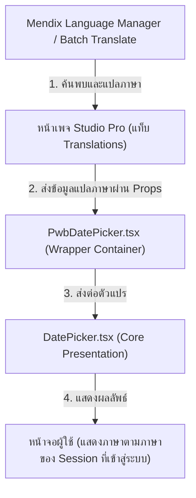

# แนวทางการทำ Localization และ Batch Translate สำหรับ Custom Mendix Widget

เอกสารฉบับนี้จัดทำขึ้นเพื่อเป็น **เกร็ดความรู้และแนวทางปฏิบัติ (Best Practices)** สำหรับนักพัฒนาที่ต้องการทำระบบหลายภาษา (Localization) ให้กับ Custom Mendix Pluggable Widget เพื่อให้ตัววิดเจ็ตสามารถทำงานร่วมกับระบบ **Batch Translate** และ **Language Manager** ของ Mendix Studio Pro ได้อย่างสมบูรณ์แบบ 100%

---

## 🎯 ปัญหาหลักของการแปลภาษาใน Custom Widget

ตามสถาปัตยกรรมของ Mendix Pluggable Widget ตัวไฟล์ซอร์สโค้ดของ React (`.tsx`, `.js`) จะถูกคอมไพล์และบีบอัดให้อยู่ในรูปไฟล์บันเดิลเดี่ยวในโฟลเดอร์ `/dist/`

> [!WARNING]
> **ข้อจำกัดสำคัญ**: ฟีเจอร์ **Batch Translate** ของ Mendix Studio Pro จะสแกนเฉพาะไฟล์การตั้งค่า XML ของแอป, หน้าเพจ (`.page.xml`), และ Microflow เท่านั้น **ไม่สามารถเข้าไปสแกนอ่านข้อความที่ฮาร์ดโค้ด (Hardcoded String) อยู่ภายในไฟล์ JavaScript/TSX ได้**
> 
> *ดังนั้น หากเขียนคำว่า `"วันนี้ (Today)"` ลงไปในโค้ด React ตรง ๆ คำเหล่านี้จะไม่ออกมาแสดงในตารางแปลภาษาของโปรแกรม Mendix*

---

## 💡 แนวทางการแก้ไขที่ถูกต้อง (Mendix Best Practice Pattern)

สถาปัตยกรรมที่เป็นมาตรฐานและรองรับระบบแปลภาษาของ Mendix ได้สมบูรณ์ที่สุดคือ **"Property Injection Pattern"** ซึ่งเป็นการส่งผ่านข้อความแปลภาษาผ่าน Properties จากฝั่ง Mendix เข้ามายังคอมโพเนนต์ React โดยมีแผนภาพการทำงานดังนี้:



---

## 🛠️ ขั้นตอนการติดตั้งและโครงสร้างโค้ดตัวอย่าง

### 1. ประกาศคุณสมบัติข้อความใน XML Schema (`widgetName.xml`)
เปิดช่องกรอกข้อความ (Properties) ในโครงสร้าง XML เพื่อให้ Mendix มองเห็นและจัดเก็บข้อความเป็นฟิลด์หนึ่งในหน้าเพจ เพื่อให้ระบบ Batch Translate ตรวจจับได้

*ไฟล์ตัวอย่าง*: [PwbDatePicker.xml](file:///Users/lapat.ta/Desktop/ETC%20Project/Customize-mendix-widget-pwb-antigravity/pwbDatePicker/src/PwbDatePicker.xml)
```xml
<propertyGroup caption="Translations">
    <property key="todayPresetLabel" type="string" required="false" defaultValue="วันนี้ (Today)">
        <caption>Today Preset Button Label</caption>
        <description>ข้อความบนปุ่มทางลัดเลือกวันปัจจุบัน</description>
    </property>
    <property key="clearPresetLabel" type="string" required="false" defaultValue="ล้างค่า (Clear)">
        <caption>Clear Preset Button Label</caption>
        <description>ข้อความบนปุ่มรีเซ็ตค่า</description>
    </property>
</propertyGroup>
```

---

### 2. ดึงค่าจาก Props ในตัวครอบหลัก (Container Wrapper)
ฝั่ง Container Wrapper ของ Mendix จะต้องดึงข้อมูล Props เหล่านี้ออกมา (ซึ่งตัว Mendix Tools จะทำการอัปเดตประเภทตัวแปร TypeScript ในโฟลเดอร์ `typings/` ให้เองโดยอัตโนมัติเมื่อกดบิวด์) และนำมาส่งผ่านไปยังตัวเรนเดอร์ย่อย

*ไฟล์ตัวอย่าง*: [PwbDatePicker.tsx](file:///Users/lapat.ta/Desktop/ETC%20Project/Customize-mendix-widget-pwb-antigravity/pwbDatePicker/src/PwbDatePicker.tsx)
```tsx
export function PwbDatePicker({
    todayPresetLabel,
    clearPresetLabel
    // ... props อื่น ๆ
}: PwbDatePickerContainerProps): ReactElement {
    return (
        <DatePicker
            todayPresetLabel={todayPresetLabel}
            clearPresetLabel={clearPresetLabel}
            // ... props อื่น ๆ
        />
    );
}
```

---

### 3. นำตัวแปรไปแสดงผลพร้อมระบบ Fallback ใน Core UI
ในตัว UI หลักของ React ให้นำตัวแปรข้อความนี้ไปแสดงในตำแหน่งที่เหมาะสม โดยมีข้อแนะนำในการใส่ **Fallback Value (ค่าสำรองเริ่มต้น)** เผื่อในกรณีที่นักพัฒนาคนอื่นไม่ได้ระบุข้อความลงไปในแผงคุณสมบัติใน Mendix วิดเจ็ตจะได้ไม่ว่างเปล่า

*ไฟล์ตัวอย่าง*: [DatePicker.tsx](file:///Users/lapat.ta/Desktop/ETC%20Project/Customize-mendix-widget-pwb-antigravity/pwbDatePicker/src/components/DatePicker.tsx)
```tsx
export interface DatePickerProps {
    todayPresetLabel?: string;
    clearPresetLabel?: string;
    // ... props อื่น ๆ
}

export function DatePicker({
    todayPresetLabel,
    clearPresetLabel
    // ...
}: DatePickerProps): ReactElement {
    return (
        <div className="pwb-presets-panel">
            <button type="button" className="pwb-preset-btn">
                {/* หากมีข้อความจาก Mendix ให้แสดงผลตามนั้น หากไม่มีให้ใช้ค่าเริ่มต้นสองภาษา */}
                {todayPresetLabel || "วันนี้ (Today)"}
            </button>
            <button type="button" className="pwb-preset-btn">
                {clearPresetLabel || "ล้างค่า (Clear)"}
            </button>
        </div>
    );
}
```

---

## ⚡ วิธีสำรอง: การใช้ตรวจจับภาษาแบบ Dynamic Client-Side (Dynamic Locale)

นอกจากการสร้าง Property เพื่อเชื่อมโยงกับระบบ Batch Translate แล้ว เรายังมีทางเลือกอื่นในระดับโค้ด JavaScript ที่ไม่ต้องสร้างคุณสมบัติข้อความใน XML เพิ่มเติม นั่นคือ **การดึงโค้ดภาษาจากระบบของ Mendix โดยตรงที่ระดับรันไทม์**

### ตัวอย่างการตรวจสอบรันไทม์ภาษา:
เราสามารถเข้าถึงข้อมูล Active Language ของเซสชันเบราว์เซอร์ปัจจุบันได้ผ่าน Global Object `mx`:
```javascript
const getActiveLanguage = () => {
    try {
        // จะคืนค่าเช่น "th_TH", "en_US", "ja_JP" ตามภาษาที่ผู้ใช้เลือกในระบบ Mendix
        return window.mx.session.sessionData.locale.code;
    } catch (e) {
        return "en_US"; // Fallback ปลอดภัย
    }
};

// ตรรกะการเลือกข้อความแบบเรียลไทม์
const currentLanguage = getActiveLanguage();
const todayText = currentLanguage.startsWith("th") ? "วันนี้" : "Today";
```

### ⚖️ การเปรียบเทียบระหว่าง 2 วิธี

| ด้านการประเมิน | วิธีที่ 1: Property Injection (แนะนำ) | วิธีที่ 2: Dynamic Client-Side |
| :--- | :--- | :--- |
| **การรองรับ Batch Translate** | **รองรับ 100%** ผ่าน Language Manager | **ไม่รองรับ** (ไม่พบฟิลด์ใน Mendix) |
| **ความสะดวกในการพัฒนา** | ต้องประกาศ Property ใน XML และส่งข้อมูลต่อ | เขียนคำสั่ง JS ตรวจสอบที่ Core UI ได้ทันที |
| **ความยืดหยุ่นของภาษา** | ยืดหยุ่นสูงสุด (ลูกค้าสามารถเข้ามาแก้ไขคำแปลได้เองใน Mendix) | ฟิกซ์คำแปลตายตัวตามที่เขียนไว้ในโค้ด JavaScript |
| **ความเหมาะสม** | เหมาะสำหรับ **คำทั่วไป, ป้ายชี้บ่ง, และปุ่มกด** | เหมาะสำหรับ **ชื่อวันในสัปดาห์ หรือชื่อเดือนสากล** |

---

## 💡 สรุปแนวทางปฏิบัติ
เพื่อความสะดวกรวดเร็วในการพัฒนาและประสิทธิภาพสูงสุดของ UX ใน Custom Widget:
1. สำหรับ **ข้อความทั่วไป (UI Labels, Buttons, Placeholders)** แนะนำให้ใช้วิธี **Property Injection** เพื่อให้แอป Mendix ทำการแปลภาษาแบบรวมศูนย์ผ่านระบบ Batch Translate ได้
2. สำหรับ **ปฏิทินหรือวันเวลา (Calendar Grid, Months, Weekdays)** แนะนำให้ใช้วิธี **Dynamic Client-Side หรือใช้ API มาตรฐานของเบราว์เซอร์** (เช่น `Intl.DateTimeFormat`) เพื่อให้ปรับวันเวลาตามภาษาของเบราว์เซอร์และเครื่องเซิร์ฟเวอร์โดยอัตโนมัติ ป้องกันความซ้ำซ้อนของการตั้งค่า
