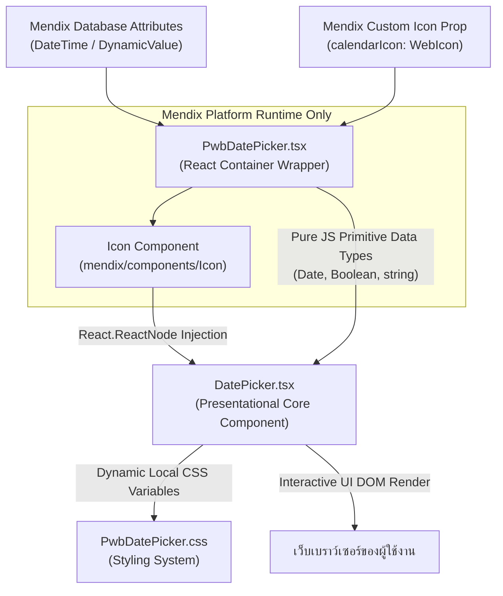

# รายละเอียดและการทำงานของ Mendix Custom Widget (PwbDatePicker)

เอกสารฉบับนี้อธิบายถึงสถาปัตยกรรม โครงสร้าง โฟลว์การไหลของข้อมูล และตรรกะการทำงานของ **PWB Advanced DatePicker (v1.0.5)** ซึ่งเป็น Pluggable Widget คุณภาพสูงสำหรับขยายขีดความสามารถ UI/UX ของการเลือกวันที่และเวลาภายในโครงการ Mendix Studio Pro

---

## 🚀 ภาพรวมของ Widget (Widget Overview)

*   **ชื่ออย่างเป็นทางการ:** `PWB Advanced DatePicker`
*   **Widget ID:** `pwb.pwbdatepicker.PwbDatePicker`
*   **สถาปัตยกรรมเทคโนโลยี:** React 19 (Function Components & State Hooks) + TypeScript 5
*   **แพลตฟอร์มเป้าหมาย:** Web Browser (Desktop / Mobile Responsive)
*   **คอนเซปต์ UI/UX:** Glassmorphic Premium Design (ดีไซน์กระจกฝ้าหรูหราทันสมัย พร้อมแอนิเมชันเปลี่ยนผ่านสมูทลื่นไหล)

---

## 🛠️ สถาปัตยกรรมและโฟลว์ข้อมูล (Data Flow & React Node Injection)

วิดเจ็ตนี้ทำงานโดยใช้สถาปัตยกรรมแยกส่วนบทบาทหน้าที่อย่างชัดเจน (Decoupled Presentational Architecture) เพื่อลดการพึ่งพาระบบรันไทม์หลังบ้านของ Mendix ส่งผลให้คุณสามารถเปิดรันทดสอบบนโลคอลเบราว์เซอร์เดี่ยว ๆ ได้ทันทีผ่านเครื่องมือ **Vite Playground Dashboard**

แผนภาพการไหลเวียนของข้อมูลและส่วนประกอบ:

### 1. บทบาทของ Container Wrapper ([PwbDatePicker.tsx](file:///Users/lapat.ta/Desktop/ETC%20Project/Customize-mendix-widget-pwb-antigravity/pwbDatePicker/src/PwbDatePicker.tsx))
- ทำหน้าที่เป็นสะพานเชื่อมต่อโดยตรงกับ Mendix Platform Runtime
- ทำการแกะค่า (Extract) ข้อมูลดิบจากฐานข้อมูล Mendix เช่น `dateAttribute.value`, `calendarIcon.value`
- จัดการแปลงข้อขัดข้องการเรียกนำเข้าคอมโพเนนต์ Mendix (ซึ่งจะส่งผลให้โปรแกรมแครชเมื่อรันข้างนอก) ด้วยการประมวลผลโมดูล `<Icon>` ในเลเยอร์นี้ แล้วส่งข้ามไปด้วยเทคนิค **React Node Injection Pattern (ผ่านตัวแปร `customIcon`)** ทำให้ตัวคอมโพเนนต์แกนหลักทำงานได้อย่างเป็นอิสระ

### 2. บทบาทของคอมโพเนนต์นำเสนอแกนหลัก ([DatePicker.tsx](file:///Users/lapat.ta/Desktop/ETC%20Project/Customize-mendix-widget-pwb-antigravity/pwbDatePicker/src/components/DatePicker.tsx))
- เป็นหัวใจหลักของฟังก์ชันปฏิทิน ไม่มีการนำเข้าแพ็คเกจหรือโมดูลใด ๆ ของ Mendix เพื่อรักษาความเป็นอิสระสูงสุด (Pure Presentational Component)
- ควบคุมสถานะภายในทั้งหมด ได้แก่ ปี พ.ศ. (Offset +543), หน้าต่างกรอกชั่วโมง/นาทีป้อนตรง, ระบบกดเปลี่ยนเดือนด้วยแอนิเมชันแบบสไลด์ข้าง, แผงตารางเลือกเดือน-ปีแบบด่วน (Month/Year Quick Jump), และตารางปุ่มลัดวันที่ (Presets Panel)
- รองรับการทำงานในแบบ **Single Mode** และ **Airbnb Pill Range Selection Mode**

### 3. บทบาทของไฟล์ตกแต่งรูปลักษณ์ ([PwbDatePicker.css](file:///Users/lapat.ta/Desktop/ETC%20Project/Customize-mendix-widget-pwb-antigravity/pwbDatePicker/src/ui/PwbDatePicker.css))
- ใช้ระบบควบคุมสไตล์ผ่านคุณสมบัติตัวแปรโลคอล CSS (CSS Custom Properties) โดยเชื่อมค่าโดยตรงมาจากแท็บ Aesthetics ใน Mendix ทำให้สามารถดัดแปลงความโค้งมน, เอฟเฟกต์เบลอกระจก, สีสันของธีม หรือความใสของสีพื้นหลังได้อย่างรวดเร็ว

---

## ⚙️ โครงสร้างการตั้งค่าแผงควบคุม Properties (XML Schema)

คุณสมบัติทั้งหมดที่ถูกนิยามไว้ใน [PwbDatePicker.xml](file:///Users/lapat.ta/Desktop/ETC%20Project/Customize-mendix-widget-pwb-antigravity/pwbDatePicker/src/PwbDatePicker.xml) เพื่อแสดงผลในหน้าจอตั้งค่าของโปรแกรม Mendix Studio Pro:

### 1. General (การเลือกโหมดและผูกตัวแปรฐานข้อมูล)
*   `selectionMode`: ตัวเลือกว่าจะใช้ระบบปฏิทินเลือกวันเดียว (`single`) หรือเลือกช่วงวันเริ่มต้น-สิ้นสุด (`range`)
*   `dateAttribute`: ฟิลด์ตัวแปรประเภท DateTime จากฐานข้อมูลสำหรับเก็บวันเลือกในโหมดวันเดียว
*   `startDateAttribute` / `endDateAttribute`: ฟิลด์ตัวแปรป้อนช่วงวันที่เริ่มต้นและสิ้นสุด

### 2. Features (การเปิด-ปิดความสามารถยืดหยุ่น)
*   `showTime`: สวิตช์ Boolean เปิดทำงานช่องกรอกพิมพ์เวลาตัวเลขชั่วโมงและนาทีโดยตรง
*   `buddhistEra`: ตั้งค่าเริ่มต้นแสดงผลปีปฏิทินในรูปแบบปี พ.ศ. ไทย (+543 ปี)
*   `showPresets`: สวิตช์เปิด-ปิดแถบปุ่มลัดรวดเร็ว (วันนี้, 7 วันล่าสุด, เดือนนี้)
*   `showEraToggle`: เปิดแสดงสวิตช์แลกเปลี่ยนปีแบบสด "พ.ศ. / ค.ศ." บนหัวปฏิทิน

### 3. Constraints (ระบบล็อกกรอบความปลอดภัย)
*   `minDate` / `maxDate`: กำหนดขอบเขตจำกัดวันที่ห้ามเลือก ต่ำสุด-สูงสุด ผ่าน Expression
*   `disableWeekends`: บล็อกห้ามผู้ใช้คลิกเลือกวันเสาร์และวันอาทิตย์

### 4. Aesthetics (การกำหนดรูปลักษณ์ภายนอกระดับพรีเมียม)
*   `placeholder`: ข้อความแสดงผลเมื่อช่องกรอกมีค่าว่างเปล่า
*   `accentColor`: รหัสสี Hex กำหนดชุดสีเด่นของปฏิทิน (เช่น `#3b82f6` หรือสีแบรนด์ของคุณ)
*   `borderRadius`: กำหนดความโค้งมนของกล่องปฏิทิน (เช่น `16px`, `8px`, `0px`)
*   `bgBlur`: กำหนดความเข้มข้นของการเบลอกลุ่มกระจกฝ้า (Backdrop-filter blur)
*   `popoverBg`: กำหนดสีและระดับความโปร่งใสของพื้นหลังการ์ดปฏิทิน (เช่น `rgba(15, 23, 42, 0.85)`)
*   `calendarIcon` (ประเภท `icon`): ฟิลด์คลิกเปิดกล่อง Mendix Icon Selector เพื่อเปลี่ยนรูปสัญลักษณ์ในกล่องป้อนข้อมูล สามารถอัปโหลดรูปภาพ SVG ของคุณเอง หรือคลิกจิ้มไอคอน Glyphicon / FontAwesome มาตรฐานได้ทันที

### 5. Validation (ระบบตรวจความถูกต้องของข้อมูล)
*   `required` / `requiredMessage`: บังคับความจำเป็นต้องเลือกข้อมูล และกำหนดคำเตือนความผิดพลาด
*   `validationExpression` / `customValidationMessage`: เขียนกฎสูตร Boolean Expression ส่วนตัวในการประเมินวันที่ถูกเลือก และป้อนคำเตือนเฉพาะกรณีไม่ผ่านเงื่อนไขกฎดังกล่าว

### 6. Translations (ระบบ Batch Translate)
*   รองรับคำแปลแยก 7 ฟิลด์ เพื่อเชื่อมเข้ากับระบบแปลภาษาหลักของ Mendix Studio Pro:
    `timeLabel`, `todayPresetLabel`, `clearPresetLabel`, `selectMonthLabel`, `last7DaysPresetLabel`, `last30DaysPresetLabel`, `thisMonthPresetLabel`

---

## 🎨 การแสดงผลบนตัวออกแบบหน้าเพจ Mendix (Upgraded Studio Pro Editor Preview)

ความสมบูรณ์แบบของวิดเจ็ตเวอร์ชัน v1.0.5 ได้ถูกเพิ่มเติมในไฟล์ [PwbDatePicker.editorPreview.tsx](file:///Users/lapat.ta/Desktop/ETC%20Project/Customize-mendix-widget-pwb-antigravity/pwbDatePicker/src/PwbDatePicker.editorPreview.tsx):
- เมื่อคุณลากวางวิดเจ็ตลงในหน้าต่างออกแบบ (Design View) ของ Mendix Studio Pro ระบบจะแสดงผล **Mockup กล่องกรอกข้อมูลจำลอง** ที่มีความสวยงามทันสมัย มีลักษณะขอบโค้งมนตามจริง แสดงชื่อโหมดและฟิลด์ไอคอนจำลอง
- รองรับการเรนเดอร์ไอคอนตรงหน้าแผงออกแบบ:
  - หากเลือกอัปโหลดรูปไอคอนส่วนตัว (`type === "image"`) จะดึงภาพ Preview ขนาดเล็กมาแสดง
  - หากเลือกคลาสไอคอนฟอนต์ (`type === "glyph"` หรือ `"icon"`) จะแสดงไอคอนตามคลาสนั้น ๆ
  - หากทิ้งค่าว่างไว้ จะดึงไอคอนเส้นเวกเตอร์ปฏิทินจาง ๆ มาขึ้นพรีวิวให้เห็น สอดคล้องกับภาพจริงเมื่อผู้ใช้นำไปเปิดใช้งานจริงในระบบครับ
