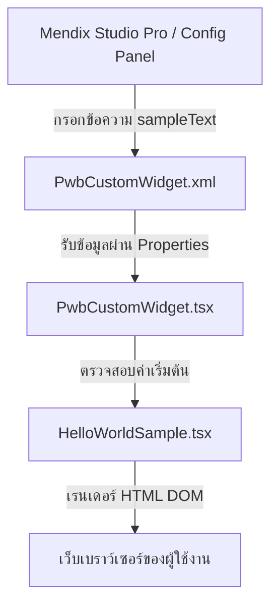

# รายละเอียดและการทำงานของ Mendix Custom Widget (PwbCustomWidget)

เอกสารฉบับนี้อธิบายถึงโครงสร้าง สถาปัตยกรรม และตรรกะการทำงานของ **PwbCustomWidget** ซึ่งเป็น Pluggable Widget ที่ถูกสร้างขึ้นเพื่อขยายความสามารถด้าน UI/UX ในโปรเจค Mendix Studio Pro

---

## 🚀 ภาพรวมของ Widget (Widget Overview)

*   **ชื่ออย่างเป็นทางการ**: `Pwb Custom Widget`
*   **Widget ID**: `pwb.pwbcustomwidget.PwbCustomWidget`
*   **สถาปัตยกรรมที่ใช้**: React (Function Components & Hooks) ร่วมกับ TypeScript
*   **เป้าหมายการรัน**: รองรับแพลตฟอร์ม Web และ Hybrid Mobile Apps

---

## 🛠️ หลักการทำงาน (Logic & Data Flow)

Widget นี้ทำงานในลักษณะ **Unidirectional Data Flow** (การไหลของข้อมูลทิศทางเดียว) จากแพลตฟอร์ม Mendix เข้าสู่คอมโพเนนต์ React ดังแผนภาพด้านล่างนี้:



1.  **การตั้งค่าใน Mendix (Configuration)**: นักพัฒนาของ Mendix จะกรอกข้อความในช่องตั้งค่า **"Default value"** ในแผงการตั้งค่าของ Widget
2.  **การผ่านข้อมูลเข้าสู่โค้ด (Data Pipeline)**: ข้อมูลจากช่องตั้งค่าดังกล่าวจะถูกเก็บและส่งผ่านตัวแปร `sampleText`
3.  **การตรวจสอบตรรกะเริ่มต้น (Logical Evaluation)**: 
    *   ถ้าผู้ใช้งานมีการพิมพ์ข้อความเข้ามา -> ส่งข้อความนั้นไปแสดงผล
    *   ถ้าไม่มีการพิมพ์ข้อความใดๆ -> ใช้คำเริ่มต้นว่า `"World"`
4.  **การแสดงผลสู่หน้าจอ (Rendering)**: React จะเรนเดอร์โครงสร้าง `div` เพื่อนำคำทักทายออกไปแสดงผลผ่านเบราว์เซอร์ในรูปแบบ `Hello [ข้อความ]`

---

## 📁 โค้ดที่ควบคุมการทำงานหลัก (Source Code Implementation)

### 1. ส่วนนิยามคุณสมบัติ (Property Definitions)
*   **ไฟล์**: [PwbCustomWidget.xml](file:///Users/lapat.ta/Desktop/ETC%20Project/Customize-mendix-widget-pwb-antigravity/pwbCustomWidget/src/PwbCustomWidget.xml)
*   **หน้าที่**: กำหนดฟิลด์ให้ฝั่ง Mendix สามารถส่งค่าเข้ามายัง Widget ได้

```xml
<?xml version="1.0" encoding="utf-8"?>
<widget id="pwb.pwbcustomwidget.PwbCustomWidget" pluginWidget="true" needsEntityContext="true" offlineCapable="true"
        supportedPlatform="Web"
        xmlns="http://www.mendix.com/widget/1.0/" xmlns:xsi="http://www.w3.org/2001/XMLSchema-instance"
        xsi:schemaLocation="http://www.mendix.com/widget/1.0/ ../node_modules/mendix/custom_widget.xsd">
    <name>Pwb Custom Widget</name>
    <description>Custom pluggable widget developed with React and TypeScript.</description>
    <icon/>
    <properties>
        <propertyGroup caption="General">
            <property key="sampleText" type="string" required="false">
                <caption>Default value</caption>
                <description>Sample text input</description>
            </property>
        </propertyGroup>
    </properties>
</widget>
```

---

### 2. คอมโพเนนต์หลักที่ควบคุมระบบ (Container Component)
*   **ไฟล์**: [PwbCustomWidget.tsx](file:///Users/lapat.ta/Desktop/ETC%20Project/Customize-mendix-widget-pwb-antigravity/pwbCustomWidget/src/PwbCustomWidget.tsx)
*   **หน้าที่**: รับข้อมูล Props และเชื่อมโยง CSS สำหรับจัดแต่งรูปทรงของหน้าตา Widget

```typescript
import { ReactElement } from "react";
import { HelloWorldSample } from "./components/HelloWorldSample";
import { PwbCustomWidgetContainerProps } from "../typings/PwbCustomWidgetProps";
import "./ui/PwbCustomWidget.css";

export function PwbCustomWidget({ sampleText }: PwbCustomWidgetContainerProps): ReactElement {
    return <HelloWorldSample sampleText={sampleText ? sampleText : "World"} />;
}
```

---

### 3. ส่วนเรนเดอร์ UI ย่อย (Presentational Component)
*   **ไฟล์**: [HelloWorldSample.tsx](file:///Users/lapat.ta/Desktop/ETC%20Project/Customize-mendix-widget-pwb-antigravity/pwbCustomWidget/src/components/HelloWorldSample.tsx)
*   **หน้าที่**: แปลงข้อมูลที่ประมวลผลแล้วให้อยู่ในรูป HTML `div` เพื่อขึ้นแสดงบนหน้าจอของผู้ใช้งาน

```typescript
import { ReactElement } from "react";

export interface HelloWorldSampleProps {
    sampleText?: string;
}

export function HelloWorldSample({ sampleText }: HelloWorldSampleProps): ReactElement {
    return <div className="widget-hello-world">Hello {sampleText}</div>;
}
```

---

## 🎨 สไตล์และการตกแต่งหน้าตา (Styling Guide)

ความสวยงามของ Widget นี้สามารถจัดแต่งได้อย่างอิสระผ่านไฟล์ CSS ที่ [PwbCustomWidget.css](file:///Users/lapat.ta/Desktop/ETC%20Project/Customize-mendix-widget-pwb-antigravity/pwbCustomWidget/src/ui/PwbCustomWidget.css)

ตัวอย่างสไตล์เริ่มต้น:
```css
.widget-hello-world {
    font-weight: bold;
    color: #2b397b;
    padding: 10px;
    border-radius: 4px;
    background-color: #f4f6fa;
    display: inline-block;
}
```

---

## 💡 แนวทางการขยายความสามารถในอนาคต (Future Enhancements Guide)

เมื่อต้องการปรับปรุงหรือพัฒนาความสามารถของ Widget เพิ่มขึ้น แนะนำให้ปฏิบัติตามขั้นตอนต่อไปนี้:

1.  **การเพิ่ม Properties ใหม่**: เข้าไปเพิ่มฟิลด์ใน `<properties>` ของไฟล์ XML จากนั้นให้ทำการสั่งรันคำสั่งคอมไพล์ เพื่อสร้างประเภทตัวแปร TypeScript (Typings) ตัวใหม่ในโฟลเดอร์ `typings/` โดยอัตโนมัติ
2.  **การเรียกใช้งานฟังก์ชันซับซ้อน**: แนะนำให้สร้างคอมโพเนนต์ย่อยแยกออกมาไว้ภายใต้โฟลเดอร์ `src/components/` เพื่อแยกบทบาทความรับผิดชอบของโค้ดให้ชัดเจนและเป็นระเบียบ (Single Responsibility Principle)
3.  **การเปลี่ยนรูปแบบให้รองรับระดับ Native Mobile**: หากต้องการให้ Widget รันได้ทั้งบนระบบ Web และ iOS/Android แบบ Native ให้เปลี่ยนค่า `supportedPlatform` ในไฟล์ XML และเปลี่ยนโฟลเดอร์สไตล์ให้เป็น JavaScript Stylesheet ของ React Native แทน
