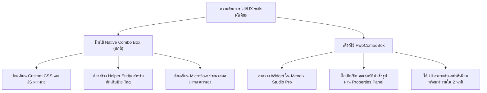

# คู่มือการเปรียบเทียบและการประยุกต์ใช้: PwbComboBox vs. Mendix Native Combo Box

เอกสารฉบับนี้จัดทำขึ้นเป็นสรุปวิเคราะห์เปรียบเทียบการทำงาน ความเหมาะสม ความง่ายในการพัฒนา และความแตกต่างในระดับสถาปัตยกรรมของตัวคอนโทรล **PwbComboBox (Premium)** เทียบกับ **Mendix Native Combo Box (ปกติ)** เพื่อเป็นแนวทางประกอบการตัดสินใจสำหรับทีมพัฒนาของ PWB ในการเลือกใช้งานวิดเจ็ตในแต่ละหน้าจอ

---

## 🗺️ ตารางเปรียบเทียบฟังก์ชันและความสามารถโดยละเอียด (Detailed Comparison Matrix)

| หัวข้อการพิจารณา | Mendix Native Combo Box (ปกติ) | PwbComboBox (Premium) |
| :--- | :--- | :--- |
| **ความสวยงามและดีไซน์ (Aesthetics & Design)** | • เลย์เอาต์รูปแบบดั้งเดิมอิงธีมเบราว์เซอร์หรือ Bootstrap • ไม่มีแสงเงาหรือการเบลอระดับพรีเมียม | • ดีไซน์ลอยตัวสไตล์โมเดิร์น **Glassmorphism** (กระจกฝ้า) • ปรับแต่ง Accent Color และ Border Radius ได้อิสระ |
| **การรองรับรูปภาพ (Avatar / Profile Support)** | • แสดงผลได้เฉพาะข้อความธรรมดา (Text เท่านั้น) | • มีฟังก์ชัน **Option Image URL** ในตัว • ปรับแต่งรูปทรงอวตารได้ (วงกลม, วงมน macOS, สี่เหลี่ยมเป๊ะ) |
| **ระบบการระบายสีป้ายผลลัพธ์ (Tag Colorization)**| • ต้องเขียน CSS/Style Classes ครอบแบบคงที่เท่านั้น | • ระบบ **`getSmartEnumColor`** จับคีย์เวิร์ดระบายสีอัตโนมัติ • ผูกสี Dynamic ตามเงื่อนไขผลลัพธ์จากฐานข้อมูลได้ |
| **ความสามารถของระบบค้นหา (Search Matching)** | • การค้นหาตัวอักษรแบบ Substring พื้นฐานทั่วไป • สะกดตกหล่นหรือพิมพ์สลับอักษรนิดเดียวจะไม่พบผลลัพธ์ | • มี **5 อัลกอริทึมค้นหา** รวมถึง **Fuzzy Search** อัจฉริยะ • มีระบบหน่วงเวลาคำสั่งพิมพ์ **(Search Debounce)** ในตัว |
| **การจัดการข้อมูลปริมาณมาก (Virtualization)** | • หน้าเว็บจะกระตุก (DOM Lag) หากเรนเดอร์ตัวเลือกเกิน 500+ แถว | • ใช้ระบบ **Recycled Node Virtualization** • ทำงานได้ลื่นไหล 60fps แม้ข้อมูลตัวเลือกจะมี 1,000+ รายการ |
| **การแสดงผลแถวรายการ (List Layout)** | • ลิสต์แนวดิ่งแถวเดี่ยวมาตรฐานเท่านั้น | • ปรับเลย์เอาต์เป็นแบบการ์ดประหยัดพื้นที่ **2-Column Grid Cards** ได้ |
| **ปุ่มลัดจัดการรายการ (Quick Control Buttons)** | • ไม่มีปุ่มลัดการเคลียร์หรือการเลือกรายการพร้อมกัน | • มีปุ่มลัดด่วน **Select All / Deselect All** ด้านบนสุดของแผงลอย |

---

## 🧠 การเปรียบเทียบในมิติ "ความยาก-ง่ายในการพัฒนา" (Ease of Development)

การประเมินว่าเครื่องมือใด **"ใช้งานง่ายกว่ากัน"** ขึ้นอยู่กับประเภทของโจทย์และระดับความซับซ้อนของฟังก์ชันการใช้งานในหน้าจอนั้นๆ:

### 🟢 กรณีที่ 1: เลือกใช้ Mendix Native Combo Box ง่ายกว่า
*   **เมื่อตัวเลือกสั้นและเรียบง่าย**: รายการตัวเลือกมีจำนวนน้อยและตายตัว เช่น การเลือกเพศ (ชาย/หญิง) หรือการเลือกเปิด/ปิดสถานะเบื้องต้น
*   **ฟอร์มข้อมูลมาตรฐานที่ไม่เน้น UI**: งานหลังบ้านระดับแอดมินทั่วไป (Back-office system) ที่ไม่ได้ให้ความสำคัญด้านมิติความงดงาม แสงเงา หรือความดึงดูดสายตาของผู้ใช้ปลายทาง
*   **ไม่มีกฎความสัมพันธ์ข้อมูล**: ไม่จำเป็นต้องแสดงรูปอวตาร, ไม่ต้องการจัดกลุ่มหมวดหมู่ตัวเลือกย่อย และไม่ต้องมีคำอธิบายบรรทัดที่สอง

---

### 🔵 กรณีที่ 2: เลือกใช้ PwbComboBox ง่ายกว่า (ประหยัดเวลาและพลังงานมหาศาล)
หากมีโจทย์ความต้องการที่มีความซับซ้อน ปรากฏขึ้นแม้แต่เพียงข้อเดียว การเลือกใช้ **PwbComboBox** จะง่ายกว่าการสู้ฝืนพัฒนาด้วยวิดเจ็ตธรรมดาอย่างยิ่ง:

#### ประเด็นความง่ายในการพัฒนาฟังก์ชันยอดฮิต:
1.  **การระบายสีป้ายข้อความ (Dynamic Tag Colors)**:
    *   *ใช้ตัวปกติ*: ต้องสร้าง Style classes สองหลักสิบชุดขึ้นไปในไฟล์ `.css` และใช้สมการครอบชื่อคลาสในการกรอก
    *   *ใช้ PwbComboBox*: เพียงเขียน Expression ส่งรหัสสี Hex จากฐานข้อมูล (เช่น `$currentObject/ColorCode`) ตัวป้ายจะเปลี่ยนสีทันทีอย่างสวยงาม
2.  **การสืบค้นข้อมูลเชิงลึก (Fuzzy Search & Debounce)**:
    *   *ใช้ตัวปกติ*: หากข้อมูลเยอะเกินและตัวสะกดไม่ตรง จะหาข้อมูลไม่พบ ทำให้ผู้ใช้คิดว่าไม่มีรายการนั้นอยู่จริงในระบบ
    *   *ใช้ PwbComboBox*: ระบบสืบค้นสะกดตกหล่น (Fuzzy Search) และการหน่วงเวลา (Debounce) ถูกติดตั้งมาเสร็จสรรพในตัว ทำให้ระบบฐานข้อมูลเซิร์ฟเวอร์ไม่ทำงานหนักเกินไป
3.  **การทำ Custom Option Layout (หน้าตาตัวเลือกอิสระ)**:
    *   *ใช้ตัวปกติ*: ไม่สามารถทำได้เลยนอกจากทำ Dropdown ของหน้านั้นใหม่ทั้งหมด
    *   *ใช้ PwbComboBox*: มีฟังก์ชัน **Custom Option Content** ในตัว ช่วยให้ผู้พัฒนาวางวิดเจ็ตอื่นๆ ซ้อนลงไปใน Dropdown แต่ละช่องได้ทันที 100%

---

## 🎯 สรุปคำแนะนำในการปฏิบัติงาน (Practical Recommendations)

1.  **สำหรับการกรอกฟิลด์ข้อมูลขั้นพื้นฐาน (Simple Fields)**: แนะนำให้ใช้ **Mendix Native Combo Box** เพื่อความเบาบางและรวดเร็วในการเปิดใช้งานครั้งแรกโดยไม่ต้องกำหนดค่าพารามิเตอร์เพิ่มเติม
2.  **สำหรับหน้าจอหลักที่มองเห็นโดยผู้ใช้ภายนอก / ลูกค้า (Customer-Facing/Portal)**: แนะนำให้บังคับใช้ **PwbComboBox** เพื่อภาพลักษณ์แบรนด์ที่หรูหรา และสยบปัญหาการพิมพ์ตัวสะกดสลับกันค้นหาไม่เจอของลูกค้า ช่วยยกระดับคะแนนความพึงพอใจการใช้งานผลิตภัณฑ์ (System Usability Score) ได้อย่างมีนัยสำคัญ
3.  **สำหรับการจัดการเลือกรายการพร้อมกันปริมาณมาก (Bulk selection / Tagging)**: แนะนำให้ใช้ **PwbComboBox** เพื่อความสะดวกในการกวาดสายตาคัดกรองข้อมูลด้วยปุ่ม Select All และลดความแออัดของหน้าจออินพุตผ่านพารามิเตอร์จำกัดพื้นที่ป้าย Tag ล้น
