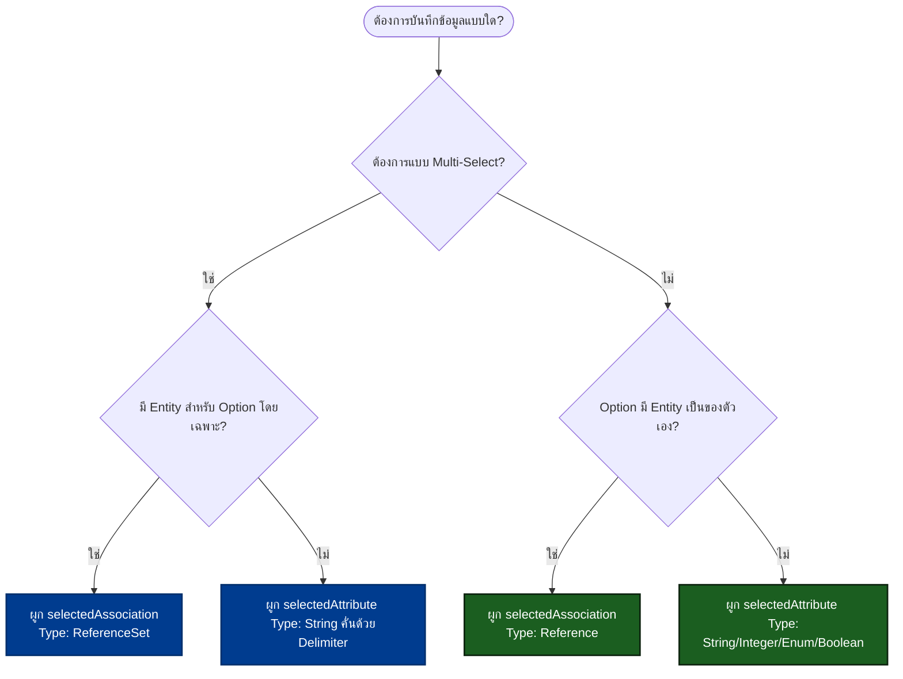

# 🗄️ คู่มือการตั้งค่า Store Value (บันทึกค่ากลับไปยัง Entity) — PwbComboBox

เอกสารฉบับนี้อธิบายโครงสร้างและแนวทางการกำหนดค่า **Store Value** สำหรับ Widget **PwbComboBox** เพื่อเก็บบันทึกข้อมูลตัวเลือกที่ผู้ใช้เลือก (Selection) กลับเข้าสู่ Mendix Database / Entity ของโปรเจกต์ได้อย่างถูกต้องและมีประสิทธิภาพ

---

## 📌 สรุปโครงสร้างการบันทึกค่ากลับไปยัง Entity

Widget `PwbComboBox` มี Properties หลักที่ใช้สำหรับเก็บบันทึกข้อมูล (อยู่ในแท็บ **General → Data source**) จำนวน 2 ตัวเลือกหลัก ซึ่งสามารถทำหน้าที่แทนกันหรือทำงานร่วมกันได้ ขึ้นอยู่กับประเภทของการจัดเก็บข้อมูล:

### 1. `selectedAttribute` (Attribute)

* **ประเภท Property:** `attribute`
* **ประเภทข้อมูลที่รองรับ:** `String`, `Integer`, `Enum`, `Boolean`
* **การใช้งาน:** ใช้เมื่อต้องการบันทึกค่า (Value/Label/Key) ลงใน Attribute ของ Context Entity ปัจจุบันโดยตรง

### 2. `selectedAssociation` (Selected Association)

* **ประเภท Property:** `association`
* **ประเภทความสัมพันธ์ที่รองรับ:**
  * `Reference` (สำหรับ Single Select)
  * `ReferenceSet` (สำหรับ Multi Select)
* **การใช้งาน:** ใช้เชื่อมโยงความสัมพันธ์ของ Context Entity ปัจจุบัน ไปยัง Object ปลายทาง (Entity ของชุด Option)

---

## ⚙️ รูปแบบการจัดเก็บข้อมูล (Data Storage Patterns) ที่รองรับ 4 รูปแบบ

ตัว Widget ออกแบบมารองรับ Pattern การบันทึกข้อมูลยอดนิยมของ Mendix ทั้งหมด ดังนี้:

### 🅰️ Pattern 1: String Attribute (Single Select)

* **แนวคิด:** บันทึกข้อความ (Label/Value) ของตัวเลือกที่โลกลงใน String Attribute โดยตรง
* **ตัวอย่าง:** เลือก `"Thailand"` $\rightarrow$ บันทึก `"Thailand"` ลงใน `Customer.CountryName (String)`
* **เหมาะสำหรับ:** ข้อมูลตัวเลือกที่ง่ายและไม่มี Entity เฉพาะเป็นของตัวเอง (เช่น รหัสประเทศ, สถานะเบื้องต้น)

### 🅱️ Pattern 2: Integer Attribute (Single Select via ID)

* **แนวคิด:** บันทึกค่าตัวเลข ID ของตัวเลือกที่เลือกลงใน Integer Attribute
* **ตัวอย่าง:** เลือก `"Manager" (ID = 3)` $\rightarrow$ บันทึก `3` ลงใน `Employee.RoleID (Integer)`
* **เหมาะสำหรับ:** Option list ที่ดึงมาจาก lookup table/master data ที่ใช้ ID เป็น Primary Key ในระบบภายนอก

### 🅲 Pattern 3: Reference Association (Single Select - Object Pointer)

* **แนวคิด:** สร้างความสัมพันธ์ (Foreign Key) ไปยัง Object ปลายทางด้วย Association แบบ 1-to-Many
* **ตัวอย่าง:** เลือก `"Product A" (GUID: abc-123)` $\rightarrow$ บันทึกความสัมพันธ์ `Order_Product` ชี้ไปยัง `Product` ตัวนั้น
* **เหมาะสำหรับ:** ตัวเลือกที่มี Entity ของตัวเอง เช่น ข้อมูลพนักงาน, รายชื่อสินค้า, และต้องการความสมบูรณ์ของโครงสร้างข้อมูล (Data Integrity)

### 🅳 Pattern 4: Multi-Select (จัดเก็บแบบหลายตัวเลือก)

สามารถแบ่งได้เป็น 2 ข้อย่อยขึ้นอยู่กับรูปแบบฐานข้อมูลที่ออกแบบไว้:

* **4.1) ReferenceSet Association (แนะนำ):**
  * สร้างความสัมพันธ์แบบ Many-to-Many ผ่าน Junction Table ของ Mendix
  * **ตัวอย่าง:** เลือก `["Tag A", "Tag B"]` $\rightarrow$ บันทึกความสัมพันธ์ `Article_Tags` ชี้ไปยัง `Tag` ทั้ง 2 Objects
  * **เหมาะสำหรับ:** ระบบ Tags, Categories หรือความสัมพันธ์ที่ต้องการ Join Query จาก Database ในอนาคต
* **4.2) Delimited String Attribute:**
  * บันทึกข้อมูลหลายรายการที่เลือกลงใน String Attribute เดียวกัน โดยมีเครื่องหมายแยกคำ (Delimiter)
  * **ตัวอย่าง:** เลือก `["Bangkok", "Phuket"]` $\rightarrow$ บันทึกข้อความ `"Bangkok, Phuket"` ลงใน `Customer.Cities (String)`
  * **เหมาะสำหรับ:** ความต้องการเก็บข้อมูลประวัติแบบง่ายๆ ไม่ต้องการ Query หรือ Join ซับซ้อนในระดับฐานข้อมูล

---

## 🧭 แผนภาพช่วยตัดสินใจการเลือกใช้ (Decision Guide)

เพื่อความง่ายในการเลือกกำหนดค่า in Mendix Studio Pro สามารถพิจารณาตามผังด้านล่างนี้ได้เลยครับ:

---

*เอกสารฉบับนี้อัปเดตอ้างอิงตามโครงสร้างของ PwbComboBox เวอร์ชัน 3.10.0 ล่าสุด*
