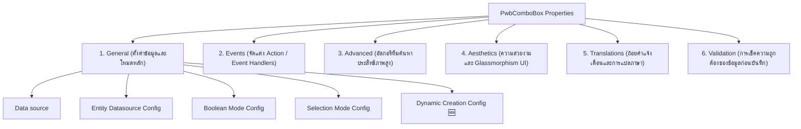

# คู่มือการตั้งค่าคุณสมบัติ PWB Advanced ComboBox (Widget Properties Guide)

เอกสารฉบับนี้เป็นคู่มือสรุปรายละเอียดและอธิบายการตั้งค่า Properties ของตัวใช้งานปลั๊กอิน **PwbComboBox (v3.10.0)** โดยอ้างอิงตรงจากโครงสร้าง [PwbComboBox.xml](file:///Users/lapat.ta/Desktop/ETC%20Project/Customize-mendix-widget-pwb-antigravity/pwbComboBox/src/PwbComboBox.xml) เพื่อให้ผู้พัฒนาของ PWB เข้าใจถึงหน้าที่, ความสำคัญ และผลลัพธ์ในการปรับปรุงแต่ละหัวข้อภายใน Mendix Studio Pro

---

## 🗺️ สรุปโครงสร้างแท็บหลัก (Properties Sheet Map)

Properties ของ Widget ถูกจัดสรรออกเป็น 6 แท็บหลักตามหลักสากลของ Mendix เพื่อการแบ่งแยกสัดส่วนการทำหน้าที่ (Separation of Concerns) ดังนี้:

---

## 1. General Tab (แถบตั้งค่าทั่วไป)

แท็บหลักสำหรับผูกข้อมูล (Data Binding) เข้ากับ Domain Model ของ Mendix พร้อมระบุแหล่งข้อมูลและโหมดการบันทึกข้อมูลหลัก

### 📂 Data source Group (กลุ่มตั้งค่าแหล่งข้อมูล)

| Property Key | Caption (ชื่อใน Mendix) | Type (ประเภท) | Default | คำอธิบายและความสำคัญ | ผลลัพธ์และผลกระทบต่อหน้าตา / ฟังก์ชันการใช้งาน |
| :--- | :--- | :--- | :---: | :--- | :--- |
| `sourceMode` | **Data Source Mode** | Enumeration | `association` | **สำคัญมาก**: ตัวเลือกวิถีข้อมูลหลัก มี 3 ค่า: 1) `association` (เชื่อมโยง Entity) 2) `enumeration` (ดึงจาก Enum) 3) `boolean` (ค่าจริง/เท็จ) | **เปลี่ยนหน้าตาฟังก์ชันทั้งหมด**: ควบคุมเงื่อนไขการปรากฏตัวของ Properties ในกลุ่มถัดไปตามการเลือก (Dynamic Visibility) |
| `selectedAttribute` | **Attribute** | Attribute | - | ผูก String/Integer/Enum/Boolean จาก context object สำหรับจัดเก็บผลการเลือกหลัก | **การบันทึกข้อมูล**: กำหนดเป้าหมายข้อมูลที่บันทึก หากเป็น Enum/Boolean จะใช้ความสามารถดั้งเดิมของระบบทันที |
| `selectedAssociation` | **Selected Association** | Association | - | **สำคัญสูงสุดสำหรับ Association Mode**: ผูก Reference (1-to-1) หรือ ReferenceSet (1-to-Many) ในการเชื่อมความสัมพันธ์วัตถุ | **ควบคุมโหมด Single / Multi**: ถ้าผูก ReferenceSet จะเข้าสู่โหมดเลือกได้หลายตัว (Multi-select) ทันทีโดยอ้างอิงโครงสร้างฐานข้อมูล |
| `delimiter` | **Delimiter (Multi Mode String Only)** | String | `,` | อักษรคั่นผลลัพธ์ในกรณีกดบันทึกเป็น Attribute ชนิด String ยาวๆ เช่น `A, B, C` | **การรวมสายข้อมูล**: ไม่มีผลต่อกล่อง UI แต่มีผลต่อการเรียงสายอักษรใน Database ตอนบันทึกหรือเอาค่ามาถอดรหัส |
| `maxVisibleTags` | **Max Visible Tags** | Integer | `0` | จำนวน Badge หรือ Tag ผลเลือกสูงสุดที่จะโชว์ในช่อง input ก่อนจะทำการย่อเป็นตัวเลข เช่น `+2` | **ผลต่อ UX**: หากตั้งค่าเป็น `0` จะโชว์ทั้งหมด หากต้องการลดความรุงรังของหน้าจอให้จำกัดค่า (เช่น `2` หรือ `3`) |

---

### 📂 Entity Datasource Config Group (กลุ่มตั้งค่าเชื่อมโยงฐานข้อมูล)
*กลุ่มนี้จะเปิดแสดงผลการตั้งค่าเฉพาะเมื่อ `sourceMode` ถูกเลือกเป็น `association` เท่านั้น*

| Property Key | Caption (ชื่อใน Mendix) | Type (ประเภท) | Required | คำอธิบายและความสำคัญ | ผลลัพธ์และผลกระทบต่อหน้าตา / ฟังก์ชันการใช้งาน |
| :--- | :--- | :--- | :---: | :--- | :--- |
| `optionsSource` | **Options Source** | Datasource | **Yes** | **หัวใจหลักของ Association**: แหล่งข้อมูลวัตถุที่ดึงขึ้นมาโชว์ใน Dropdown (เช่น XPath, Database Query) | **จำนวนและข้อมูลตัวเลือก**: ควบคุมประสิทธิภาพการดึงข้อมูลและระบุขอบเขตวัตถุทั้งหมดที่ผู้ใช้สามารถเห็นและค้นหาได้ |
| `optionLabel` | **Option Label** | Expression | **Yes** | การเขียน Expression ระบุข้อความหัวเรื่องหลักของแต่ละตัวเลือก (เช่น `$currentObject/Name`) | **ข้อความบรรทัดหลัก**: โชว์เป็นหัวข้ออักษรหนาหลักในแต่ละตัวเลือกบนแถว Dropdown และใช้สำหรับระบุชื่อป้าย Tag |
| `optionDetail` | **Option Detail (Subtitle)** | Expression | No | การระบุข้อความบรรทัดรองสีเทาจาง (เช่น `$currentObject/Email`) | **มิติความลึกของข้อมูล**: แสดงด้านล่างข้อความหลักช่วยให้ผู้ใช้แยกแยะรายการข้อมูลที่ชื่อซ้ำกันได้ง่ายขึ้น |
| `optionGroup` | **Option Group Category** | Expression | No | ข้อความสำหรับจัดกลุ่มรายการตัวเลือกเป็นหมวดหมู่ย่อย (เช่น `$currentObject/CategoryName`) | **โครงสร้างการแบ่งกลุ่ม**: เมื่อทำงานร่วมกับการแสดงผล จะจัดให้มีหัวข้อแบ่งกลุ่มที่สามารถยุบ/ขยายได้ใน Dropdown |
| `optionImage` | **Option Image URL** | Expression | No | นิยามที่อยู่รูปภาพหรือลิงก์โปรไฟล์เพื่อนำมาเรนเดอร์รูปภาพ (Avatar) | **ยกระดับความหรูหรา**: สร้างรูปโปรไฟล์วงกลมด้านซ้ายสุดของตัวเลือก ช่วยให้หน้าตาดูเป็นแอปพลิเคชันพรีเมียม |
| `selectedOptionLabel` | **Selected Option Label** | Expression | No | กำหนด Expression การแสดงผลชื่อในกรณีที่ตัวเลือกนั้นถูกเลือกแล้ว (เช่น ต้องการให้ตอนเลือกยาว แต่ตอนโชว์ในป้าย Tag สั้นลง) | **ผล UX พิเศษ**: เหมาะสำหรับการจำกัดขนาดพื้นที่ Badge เมื่อเลือกรายการยาวๆ เพื่อไม่ให้ล้นพื้นที่อินพุต |
| `enableGrouping` | **Enable Grouping** | Boolean | `true` | เปิด/ปิดการแสดงผลแบบแบ่งกลุ่มของหมวดหมู่ย่อย | **การจัดระเบียบสายตา**: เมื่อเป็น True จะจัดแสดงผลโดยอ้างอิงจากค่านิยามกลุ่มของ `optionGroup` |

---

### 📂 Boolean Mode Config Group (กลุ่มตั้งค่าทางเลือกจริง/เท็จ)
*กลุ่มนี้จะเปิดแสดงผลการตั้งค่าเฉพาะเมื่อ `sourceMode` ถูกเลือกเป็น `boolean` เท่านั้น*

| Property Key | Caption (ชื่อใน Mendix) | Type (ประเภท) | Default | คำอธิบายและความสำคัญ | ผลลัพธ์และผลกระทบต่อหน้าตา / ฟังก์ชันการใช้งาน |
| :--- | :--- | :--- | :---: | :--- | :--- |
| `booleanTrueLabel` | **Yes / True Display Label** | String | `Yes` | ข้อความที่จะให้ผู้ใช้อ่านเมื่อต้องการสื่อถึงค่าจริง (True) | **คำภาษาไทย/เฉพาะกลุ่ม**: เปลี่ยนคำว่า Yes เป็น "เปิดใช้งาน", "ผ่านการอนุมัติ" หรือ "ชาย" ได้ทันที |
| `booleanFalseLabel` | **No / False Display Label** | String | `No` | ข้อความที่จะให้ผู้ใช้อ่านเมื่อต้องการสื่อถึงค่าเท็จ (False) | **คำภาษาไทย/เฉพาะกลุ่ม**: เปลี่ยนคำว่า No เป็น "ระงับใช้งาน", "ไม่อนุมัติ" หรือ "หญิง" ได้ทันที |
| `booleanOutputFormat` | **Output Value Format** | Enumeration | `boolean` | กำหนดว่าจะบันทึกค่ากลับไปเป็น Boolean แท้ๆ (`true/false`) หรือจะแปลงเป็น String Key เพื่อความยืดหยุ่น | **ผลระบบปลายทาง**: ช่วยหลีกเลี่ยงข้อจำกัดกรณี Entity ออกแบบมาเป็น String แต่ต้องการหน้าตาช่องกรอกแบบ Boolean |
| `booleanTrueValue` | **True String Value Key** | String | `true` | คีย์ข้อความบันทึกจริงเมื่อเลือกค่าจริง (เช่น บันทึกคำว่า `'active'` หรือ `'Y'`) | **จัดเก็บรหัสโค้ด**: ทำงานเมื่อเลือกโหมดส่งค่าเป็นแบบ `string` เท่านั้น |
| `booleanFalseValue` | **False String Value Key** | String | `false` | คีย์ข้อความบันทึกจริงเมื่อเลือกค่าเท็จ (เช่น บันทึกคำว่า `'inactive'` หรือ `'N'`) | **จัดเก็บรหัสโค้ด**: ทำงานเมื่อเลือกโหมดส่งค่าเป็นแบบ `string` เท่านั้น |

---

### 📂 Selection Mode Config Group (กลุ่มตั้งค่ารูปแบบการเลือก)

| Property Key | Caption (ชื่อใน Mendix) | Type (ประเภท) | Default | คำอธิบายและความสำคัญ | ผลลัพธ์และผลกระทบต่อหน้าตา / ฟังก์ชันการใช้งาน |
| :--- | :--- | :--- | :---: | :--- | :--- |
| `selectionMode` | **Selection Mode** | Enumeration | `single` | เลือกระหว่างการเลือกเดี่ยว (`single`) หรือเลือกหลายรายการพร้อมกันแบบ Badge (`multi`) | **ปรับเปลี่ยนกลไกหลัก**: โหมด Multi จะอนุญาตให้ติ๊กถูกหลายตัวเลือกและแสดงป้าย Tag Badger ลบออกได้ในช่องค้นหา |
| `singleSelectStyle` | **Single Select Style** | Enumeration | `text` | รูปแบบการโชว์รายการที่ถูกเลือกในโหมดเดี่ยว: 1) `text` (ข้อความเพลน) 2) `pill` (ป้าย Badge ลบได้) 3) `rich` (การโชว์แบบหรูหราเต็มแถว) | **ผลกระทบสายตาเด่นชัด**: แบบ Rich จะโชว์รูปอวตารคู่ชื่อหลักและหัวข้อย่อยตรงช่องอินพุตหลังเลือก ทำให้ดูไฮเอนด์ |
| `showSelectedAvatar` | **Show Selected Avatar** | Boolean | `true` | เปิด/ปิดการแสดงรูปโปรไฟล์อวตารของป้ายที่เลือกแล้วในอินพุต | **การจำกัดพิกเซลอินพุต**: ปิดตัวนี้หากป้ายที่เลือกมีขนาดเบียดกันเกินไป หรือไม่ต้องการให้โชว์รูปภาพใน Badge |
| `tagStyle` | **Tag Badge Style** | Enumeration | `pill` | เลือกสไตล์ของป้าย Tag โหมดเลือกหลายรายการระหว่างแบบโค้งมน (`pill`) กับแบบวงกลมอวตารย่อ (`avatar`) | **ความสร้างสรรค์หน้าตา**: ดีไซน์ UI ได้สอดคล้องกับกรอบธีมแอปพลิเคชันของคุณ |
| `tagColorExpression` | **Tag Color (Hex/CSS)** | Expression | - | ใช้ Expression ประมวลผลรหัสสี Hex เพื่อระบายสีพื้นหลัง Tag แยกรายรายการ (เช่นดึงสีจากฐานข้อมูลของรายการนั้นๆ) | **Dynamic Badge Colors**: ป้ายผลลัพธ์แต่ละป้ายจะมีเฉดสีสดใสต่างกันตามเงื่อนไข (เช่น อนุมัติ=สีเขียว, ไม่อนุมัติ=สีแดง) |
| `showSelectAll` | **Show Select All** | Boolean | `false` | เปิดใช้งานปุ่มลัดด้านบนสุดของ Dropdown ในโหมด Multi-Select เพื่อเลือกทั้งหมดหรือล้างทั้งหมดอย่างรวดเร็ว | **ยกระดับความสะดวกรวดเร็ว**: เพิ่มปุ่มลัดช่วยให้ลดทอนความพยายามในการคลิกเลือกทีละตัวของผู้ใช้งาน |
| `selectAllText` | **Select All Text** | String | `เลือกทั้งหมด / Select All` | ข้อความบนปุ่มกดเลือกรายการทั้งหมด | **การแปลภาษา**: รองรับภาษาไทย/อังกฤษ หรือปุ่มข้อความแบบมีไอคอนประกอบ |
| `deselectAllText` | **Deselect All Text** | String | `ล้างทั้งหมด / Deselect All` | ข้อความบนปุ่มกดล้างรายการที่เลือกทั้งหมดออก | **การแปลภาษา**: รองรับภาษาไทย/อังกฤษ หรือปุ่มข้อความแบบมีไอคอนประกอบ |

---

### 📂 Dynamic Creation Config Group (กลุ่มตั้งค่าการสร้างรายการใหม่) 🆕

| Property Key | Caption (ชื่อใน Mendix) | Type (ประเภท) | Default | คำอธิบายและความสำคัญ | ผลลัพธ์และผลกระทบต่อหน้าตา / ฟังก์ชันการใช้งาน |
| :--- | :--- | :--- | :---: | :--- | :--- |
| `onCreateText` | **Create Option Text Template** | String | `+ Add '{value}'` | ข้อความ Template ของปุ่มสร้างรายการใหม่ที่จะแสดงท้าย Dropdown เมื่อการค้นหาไม่พบรายการใดตรงกัน โดย `{value}` จะถูกแทนที่ด้วยคำค้นหาของผู้ใช้ขณะรันไทม์ | **Dynamic Creation UX**: เมื่อผู้ใช้พิมพ์คำที่ยังไม่มีในรายการ ปุ่มนี้จะลอยขึ้นมาเชิญให้สร้างรายการใหม่ทันที เชื่อม **On Change Action** เพื่อ handle การสร้าง Object ใหม่ใน Microflow/Nanoflow |

---

## 2. Events Tab (แถบตั้งค่าเหตุการณ์และการทำ Action)

เป็นแถบสำหรับผูกคำสั่งหรือ Logic การทำงานเมื่อผู้ใช้ปฏิสัมพันธ์กับ Widget ด้วยรูปแบบต่างๆ

> [!NOTE]
> การประยุกต์ใช้ Event Handlers อย่างถูกต้อง จะช่วยจำกัดขอบเขตของข้อมูลและลดการประมวลผลซ้ำซ้อนได้อย่างมหาศาล

### 📂 Selection Events Group

| Property Key | Caption (ชื่อใน Mendix) | Type (ประเภท) | คำอธิบายและความสำคัญ | ผลลัพธ์และผลกระทบต่อการใช้งาน |
| :--- | :--- | :--- | :--- | :--- |
| `onChangeAction` | **On Change Action** | Action | ทำงานทันทีเมื่อค่าที่ถูกเลือกเกิดการเปลี่ยนแปลง (เลือกรายการใหม่, ลบป้าย Tag, หรือกดปุ่ม Clear) | **กลไกอัปเดตข้อมูล**: ใช้เรียก Microflow/Nanoflow เพื่อคำนวณราคาสินค้ารวมอัปเดตผล หรือเปิด/ปิดฟิลด์ข้อมูลอื่นบนจอภาพแบบเรียลไทม์ |

### 📂 Focus Events Group

| Property Key | Caption (ชื่อใน Mendix) | Type (ประเภท) | คำอธิบายและความสำคัญ | ผลลัพธ์และผลกระทบต่อการใช้งาน |
| :--- | :--- | :--- | :--- | :--- |
| `onEnterAction` | **On Enter Action** | Action | ทำงานทันทีเมื่อผู้ใช้เอาเมาส์มาคลิกหรือโฟกัสผ่านปุ่มคีย์บอร์ด Tab เข้ามายังอินพุตของ ComboBox | **การดึงข้อมูลเบื้องหลัง**: เหมาะสำหรับการโหลดข้อมูลประกอบฉากล่วงหน้า (Preload) หรือตั้งค่าเปิดการเก็บสถิติผู้เข้าใช้งาน |
| `onLeaveAction` | **On Leave Action** | Action | ทำงานทันทีเมื่อผู้ใช้ละสายตาหรือนำเมาส์ไปคลิกข้างนอกตัวควบคุม (Blur event) | **ระบบบันทึกร่างอัตโนมัติ**: เหมาะสำหรับทำคำสั่ง Auto-save บันทึกข้อมูล หรือทำระบบตรวจสอบรูปแบบข้อมูลทันทีที่พิมพ์เสร็จ |

### 📂 Filter Events Group

| Property Key | Caption (ชื่อใน Mendix) | Type (ประเภท) | คำอธิบายและความสำคัญ | ผลลัพธ์และผลกระทบต่อการใช้งาน |
| :--- | :--- | :--- | :--- | :--- |
| `onFilterChangeAction`| **On Filter Input Change Action** | Action | ทำงานเรียลไทม์ทุกช่วงการกดคีย์บอร์ดพิมพ์ตัวอักษรค้นหาใหม่ของผู้ใช้ | **Real-time Server Search**: ใช้เรียก Microflow สำหรับยิงค้นหาเชิงลึกไปยังฐานข้อมูลภายนอกแบบเรียลไทม์ตามคำสะกดที่ส่งไป |
| `filterAttribute` | **Filter Input Attribute** | Attribute | ตัวแปร String ของหน้าจอสำหรับรับค่าคำพิมพ์ค้นหาของผู้ใช้ก่อนที่จะเรียก Action ด้านบน | **การเก็บคำสืบค้น**: ช่วยให้ Microflow ด้านบนสามารถดึงคำสะกดปัจจุบันที่ผู้ใช้พิมพ์ค้างไว้มาใช้เป็นเงื่อนไขค้นหาได้ |

---

## 3. Advanced Tab (แถบตั้งค่าการทำงานขั้นสูง)

ควบคุมระบบการสืบค้นและอัลกอริทึมค้นหาแบบประหยัดพลังงานเพื่อประสิทธิภาพที่ดีที่สุดในการสืบค้นข้อมูลปริมาณมาก

### 📂 Search & Filtering Config Group

| Property Key | Caption (ชื่อใน Mendix) | Type (ประเภท) | Default | คำอธิบายและความสำคัญ | ผลลัพธ์และผลกระทบต่อหน้าตา / ฟังก์ชันการใช้งาน |
| :--- | :--- | :--- | :---: | :--- | :--- |
| `searchMethod` | **Search Matching Method** | Enumeration | `contains` | อัลกอริทึมจับคู่คำค้นหา: 1) `contains` (มีคำอยู่ข้างใน) 2) `startsWith` (ขึ้นต้นด้วย) 3) `endsWith` (ลงท้ายด้วย) 4) `equals` (ตรงกันเป๊ะ) 5) `fuzzy` (ค้นหาลื่นไหลอัจฉริยะ) | **ความยืดหยุ่นของผลค้นหา**: แบบ Fuzzy จะคำนวณตัวสะกดใกล้เคียงและลำดับใกล้เคียง แม้พิมพ์ตกหล่นก็ยังค้นหาเจอ เหมาะกับระบบสืบค้นที่ยืดหยุ่นสูง |
| `searchCaseSensitive` | **Case Sensitive Search** | Boolean | `false` | เปิด/ปิดการตรวจเคสตัวอักษรใหญ่-เล็กในการค้นหาคำภาษาอังกฤษ | **ความแม่นยำสูง**: ปิดไว้เพื่อให้ผู้ใช้ค้นหาง่ายขึ้นโดยไม่ต้องกังวลเรื่องการกดปุ่ม Shift หรือพิมพ์ตัวอักษรใหญ่-เล็ก |
| `searchDebounce` | **Search Debounce (ms)** | Integer | `300` | หน่วงเวลาเป็นมิลลิวินาทีหลังผู้ใช้หยุดพิมพ์อักษรสุดท้าย ก่อนสั่งกรองค้นหาจริง | **ลดการทำงาน Server**: ป้องกันไม่ให้แอปพลิเคชันยิงคำขอค้นหาฐานข้อมูลถี่เกินไปเมื่อผู้ใช้พิมพ์เร็วๆ ช่วยประหยัด CPU ของเซิร์ฟเวอร์ |
| `maxSearchResults` | **Max Search Results** | Integer | `0` | จำกัดจำนวนรายการวัตถุสูงสุดที่จะเรนเดอร์ลงใน UI (เช่นแสดงผลไม่เกิน 50 รายการแรก) | **การรักษาระดับความลื่นไหล**: ตั้งค่าไม่ให้หน้าจอดึงวัตถุมากเกินไปจนหน้าเว็บกระตุก (0 คือไม่จำกัดและใช้กลไกรีไซเคิลวัตถุแนวตั้ง) |

---

### 📂 Secret Performance Features (คุณสมบัติลับเพิ่มประสิทธิภาพ) 🆕 v3.10.0

> [!NOTE]
> Properties ชุดนี้ถูกซ่อนอยู่ในกลุ่ม **Advanced › Search & Filtering Config** เช่นกัน — ออกแบบมาให้เปิด/ปิดได้อิสระและ **backward compatible** กับการตั้งค่าเดิมทั้งหมด

| Property Key | Caption (ชื่อใน Mendix) | Type (ประเภท) | Default | คำอธิบายและความสำคัญ | ผลลัพธ์และผลกระทบต่อหน้าตา / ฟังก์ชันการใช้งาน |
| :--- | :--- | :--- | :---: | :--- | :--- |
| `enableWeightedSearch` | **⚡ Weighted Search Ranking** | Boolean | `true` | **[Secret Feature]** เปิดระบบจัดลำดับผลค้นหาด้วยน้ำหนักคะแนน (Score-based Ranking) แทนการแสดงผลแบบตามลำดับเดิม | **ผลลัพธ์เรียงลำดับฉลาดขึ้นทันที**: Exact Match (1000) → Starts With (800) → Word Start (600) → Contains (400) → Fuzzy (200) — ผู้ใช้เห็นสิ่งที่ตรงกันมากที่สุดก่อนเสมอ |
| `enableInfiniteScroll` | **♾️ Infinite Scroll (Lazy Load)** | Boolean | `false` | **[Secret Feature]** เปิดระบบโหลดข้อมูล Datasource ทีละ **30 รายการ** ผ่าน `optionsSource.setLimit()` เมื่อผู้ใช้ scroll ลงก้น Dropdown | **ลดเวลาโหลดครั้งแรกอย่างมหาศาล**: เหมาะกับ Entity datasource ที่มีข้อมูลหลายพันรายการ — ไม่ต้องรอโหลดทั้งหมดก่อนใช้งาน ⚠️ *ใช้ได้เฉพาะ sourceMode = Association* |
| `enableSearchCache` | **🗄️ Client-Side Search Cache** | Boolean | `true` | **[Secret Feature]** เปิดระบบ LRU Cache 5 entries สำหรับเก็บผลการกรองข้อมูลฝั่ง Client — คำค้นหาที่เคยพิมพ์แล้วจะแสดงผลทันทีโดยไม่ต้อง recompute | **ประสบการณ์ค้นหาเร็วขึ้นทันตา**: เมื่อผู้ใช้ลบตัวอักษรแล้วพิมพ์กลับคืน ระบบดึงผลจาก Cache แทนการกรองใหม่ทุกครั้ง Cache จะถูก clear อัตโนมัติเมื่อข้อมูลในรายการเปลี่ยน |

---

## 4. Aesthetics Tab (แถบความสวยงามและการออกแบบ)

ใช้สำหรับควบคุมการเรนเดอร์องค์ประกอบอินเทอร์เฟซ การเลือกใช้ชุดสี แสงเงา Glassmorphism และการปรับแต่งสไตล์ UI

| Property Key | Caption (ชื่อใน Mendix) | Type (ประเภท) | Default | คำอธิบายและความสำคัญ | ผลกระทบต่อหน้าตาภายนอกของ UI |
| :--- | :--- | :--- | :---: | :--- | :--- |
| `placeholder` | **Placeholder Text** | String | `Search and select...` | ข้อความตัวอย่างลอยในช่องอินพุตเมื่อยังไม่มีผลการเลือก | แนะนำผู้ใช้อย่างนุ่มนวลว่าสามารถพิมพ์สืบค้นสิ่งใดได้ในช่องนี้ |
| `accentColor` | **Accent Color (Hex)** | String | `#3b82f6` | รหัสสีหลักของธีมแอปพลิเคชันของคุณในระบบ Hex (เช่น `#ef4444` สีแดง) | กำหนดโทนสีของกรอบอินพุตที่เลือก, สีป้าย Tag เริ่มต้น, และสีของปุ่มเช็คถูกไฮไลต์ทั้งหมดในหนึ่งเดียว |
| `searchHighlightColor` | **Search Highlight Color**| String | - | สีเน้นสำหรับคำค้นหาที่ผู้ใช้พิมพ์ในผล Dropdown (เช่นเป็นแถบสีเหลือง) | ช่วยให้มองเห็นคำค้นหาที่แมตช์ได้เด่นชัดเร่งความเร็วในการอ่าน |
| `borderRadius` | **Border Radius** | String | `16px` | ความโค้งมนของขอบช่องค้นหาและตัวแผง Dropdown ลอย | กำหนดสไตล์ความโมเดิร์น (เช่น `16px` สไตล์ Apple โค้งมน, `0px` สไตล์คลาสสิกขอบเหลี่ยม) |
| `bgBlur` | **Background Blur** | String | `16px` | ความแรงของฟิลเตอร์เบลอฉากหลังของ Dropdown ในสไตล์กระจกฝ้า | สรรสร้างดีไซน์ Glassmorphism ส่องทะลุฉากหลังอย่างงดงามและหรูหรา |
| `popoverBg` | **Dropdown Background Color**| String | `rgba(...)` | สีพื้นหลังของแผงลอยตัวเลือก รองรับค่าความโปร่งแสง | เมื่อทำงานร่วมกับ `bgBlur` จะสร้างมิติดีไซน์ลอยตัวเหนืออินเทอร์เฟซอื่นๆ |
| `maxDropdownHeight` | **Max Dropdown Height** | String | `250px` | ความสูงสูงสุดของพื้นที่แสดงผลตัวเลือกก่อนจะให้มีแถบเลื่อนขึ้นลง | ป้องกันไม่ให้รายการตัวเลือกล้นลงไปเบียดพื้นที่ด้านล่างของเว็บไซต์ |
| `dropdownLayout` | **Dropdown List Layout** | Enumeration | `list` | ปรับเลย์เอาต์การแสดงผลตัวเลือกเป็นแบบแถวยาว (`list`) หรือแบบการ์ดประหยัดพื้นที่ 2 คอลัมน์ (`grid`) | จัดการกับเนื้อหาที่ขนาดต่างกัน แบบการ์ด grid เหมาะกับชื่อตัวเลือกที่สั้นและต้องการความไวในการสแกนสายตา |
| `optionAvatarShape` | **Option Avatar Shape** | Enumeration | `circle` | รูปทรงเรขาคณิตของรูปอวตารด้านซ้ายตัวเลือก: วงกลม (`circle`), สี่เหลี่ยมมน (`rounded`), หรือสี่เหลี่ยมเป๊ะ (`square`) | กำหนดสไตล์การสะท้อนแบรนด์ขององค์กรของคุณในจุดเล็กๆ |
| `showOptionAvatar` | **Show Option Avatar** | Boolean | `true` | กำหนดการเปิดหรือปิดภาพแสดงไอคอน/อวตารในแต่ละตัวเลือกผลลัพธ์ | ปิดใช้งานหากข้อมูลไม่มีความสำคัญด้านภาพเพื่อทำให้แถวผลลัพธ์ดูเรียบง่ายขึ้น |
| `customItemContent` | **Custom Option Content** | Widgets | - | **การขยายขีดความสามารถขั้นสูง**: อนุญาตให้วาง Layout Widget ของ Mendix ลงไปเรนเดอร์ในแต่ละแถวได้แบบ 100% | สร้าง UI ที่กำหนดเองอย่างสมบูรณ์แบบ เช่นมีปุ่มคลิก, จัดวางคอลัมน์ซับซ้อน หรือใส่ไอคอนเงื่อนไขลงไปในตัวเลือก |
| `showOptionCheckbox` | **Show Checkbox/Radio Option**| Boolean | `false` | แสดงตัวเลือก Checkbox (โหมดเลือกหลายชิ้น) หรือ Radio (โหมดเดี่ยว) ด้านหลังข้อความ | ช่วยให้ผู้ใช้แน่ใจในการตัดสินใจและเข้าใจว่าช่องนี้เลือกซ้อนได้หรือไม่ |
| `highlightColorMode` | **Hover Highlight Color Mode**| Enumeration | `accent` | เลือกว่าจะให้แถบส่องประกายเมื่อนำเมาส์ไปชี้เป็นสีหลัก (`accent`) หรือเป็นสีเฉพาะตัวของรายการนั้นๆ (`optionColor`) | ควบคุมการตอบสนองเชิงฟิสิกส์และความคิดสร้างสรรค์เมื่อปฏิสัมพันธ์ |

---

## 5. Translations Tab (แถบภาษาและการเข้าถึง)

ใช้สำหรับแปลถ้อยคำของระบบและการระบุรายละเอียดสำหรับโปรแกรมอ่านออกเสียงของคนพิการ (Accessibility & Screen Readers)

| Property Key | Caption (ชื่อใน Mendix) | Type (ประเภท) | Default | คำอธิบายและความสำคัญ | ผลลัพธ์และผลกระทบต่อหน้าตา / ฟังก์ชันการใช้งาน |
| :--- | :--- | :--- | :---: | :--- | :--- |
| `noOptionsMessage` | **No Options Alert** | String | `ไม่พบตัวเลือก / No options found` | ข้อความแจ้งเตือนสีเทาอ่อนลอยตรงกลาง Dropdown เมื่อการค้นหาไม่พบรายการใดๆ | **การสื่อสารผู้ใช้**: แนะนำให้ผู้ใช้ทราบว่าไม่มีข้อมูลตรงกับคำค้นหา ปรับปรุงข้อความให้เข้ากับภาษาท้องถิ่นได้ |
| `loadingMessage` | **Loading Text** | String | `กำลังโหลด... / Loading...` | ข้อความที่จะโชว์ให้ผู้ใช้ทราบขณะรอ Mendix ดึงข้อมูลตัวเลือกจากระบบฐานข้อมูล | **ลดการกังวลของผู้ใช้**: สื่อสารว่าระบบกำลังทำงานอยู่ ไม่ได้แอปพลิเคชันค้างหรือกดไม่ติด |
| `clearButtonTitle` | **Clear Button Accessibility Title**| String | `ล้างค่า / Clear` | ป้ายชื่อคำอธิบาย (ARIA Label) ของปุ่มกากบาทเคลียร์ค่าทั้งหมดบนช่องค้นหา | **มาตรฐานสากล WCAG**: ปรากฏเป็นข้อความคำใบ้เมื่อเอาเมาส์ชี้ และถูกอ่านออกเสียงโดยระบบ Screen Reader ช่วยเหลือผู้ทุพพลภาพทางสายตา |

---

## 6. Validation Tab (แถบตรวจสอบความถูกต้อง)

หัวข้อสำหรับควบคุมกฎเกณฑ์ข้อมูล (Data Integrity) เพื่อปกป้องไม่ให้ผู้ใช้ส่งข้อมูลที่ผิดพลาดหรือข้อมูลว่างเปล่าเข้าสู่ระบบ

| Property Key | Caption (ชื่อใน Mendix) | Type (ประเภท) | Default | คำอธิบายและความสำคัญ | ผลลัพธ์และผลกระทบต่อหน้าตา / ฟังก์ชันการใช้งาน |
| :--- | :--- | :--- | :---: | :--- | :--- |
| `required` | **Is Required** | Boolean | `false` | บังคับว่าผู้ใช้งานต้องทำการเลือกตัวเลือกอย่างน้อยหนึ่งตัวเลือก | **ความถูกต้องของฐานข้อมูล**: เมื่อเปิดใช้งาน หากผู้ใช้กดส่งฟอร์มโดยไม่ได้เลือก ระบบจะบล็อกและขึ้นแถบสีแดงแจ้งเตือนทันที |
| `requiredMessage` | **Validation Error Message** | String | `Required.` | ข้อความแจ้งเตือนสีแดงที่จะโชว์อยู่ด้านล่างอินพุต เมื่อมีผู้ฝ่าฝืนส่งฟอร์มว่างเปล่า | **คำใบ้ช่วยเหลือผู้ใช้**: อธิบายปัญหาอย่างตรงจุด เช่น "กรุณาเลือกสาขาของท่าน" เพื่อเพิ่มยอดการกรอกข้อมูลที่ถูกต้อง |
| `validationExpression` | **Custom Validation Rule** | Expression | - | สูตรตรวจสอบข้อมูลขั้นสูงแบบประยุกต์ด้วยคำสั่ง Mendix (ผลลัพธ์ของสมการต้องตอบเป็น Boolean `True` เท่านั้นจึงจะผ่าน) | **ขีดจำกัดลอจิกขั้นสูง**: ตรวจสอบเงื่อนไขซับซ้อน เช่น ห้ามเลือกแผนกไอทีหากผู้ใช้มีระดับตำแหน่งเป็นพนักงานทั่วไป |
| `customValidationMessage`| **Custom Validation Message**| String | `Selection violates custom validation rule.` | ข้อความเตือนที่จะปรากฏด้านล่างฟิลด์กรอกเมื่อสูตรการตรวจสอบด้านบนตอบออกมาเป็นค่าเท็จ (False) | **การสื่อสารข้อขัดแย้งของข้อมูล**: ชี้แจงข้อห้ามเฉพาะเจาะจงให้ผู้ใช้เข้าใจเหตุผลที่ไม่สามารถส่งข้อมูลที่เลือกนั้นๆ ได้ |

---

> [!TIP]
> **ข้อแนะนำการปฏิบัติ**: 
> 1. ควรตั้งค่า `searchDebounce` สูงขึ้นเป็น `500ms` หรือมากกว่า หากใช้งานร่วมกับ `onFilterChangeAction` ที่ดึงข้อมูลผ่านระบบเครือข่ายอินเทอร์เน็ตที่ล่าช้า เพื่อลดโหลดของ Server
> 2. พยายามเปิดใช้ `required` ร่วมกับ `requiredMessage` เสมอในส่วนของช่องกรอกข้อมูลสำคัญ เพื่อลดโอกาสการเกิดข้อผิดพลาดด้านข้อมูลในระดับของ Microflow
> 3. **Secret Feature Combo**: เปิด `enableWeightedSearch` + `enableSearchCache` พร้อมกันเสมอ (default แล้ว) เพื่อได้ประสบการณ์ค้นหาที่เร็วและฉลาดสูงสุด
> 4. เปิด `enableInfiniteScroll` เฉพาะเมื่อ Entity datasource มีข้อมูล **มากกว่า 200 รายการ** และตั้งค่า datasource ให้มี Sort Order ที่ชัดเจนก่อนเสมอ มิเช่นนั้นข้อมูลหน้าถัดไปอาจมาไม่เป็นระเบียบ
